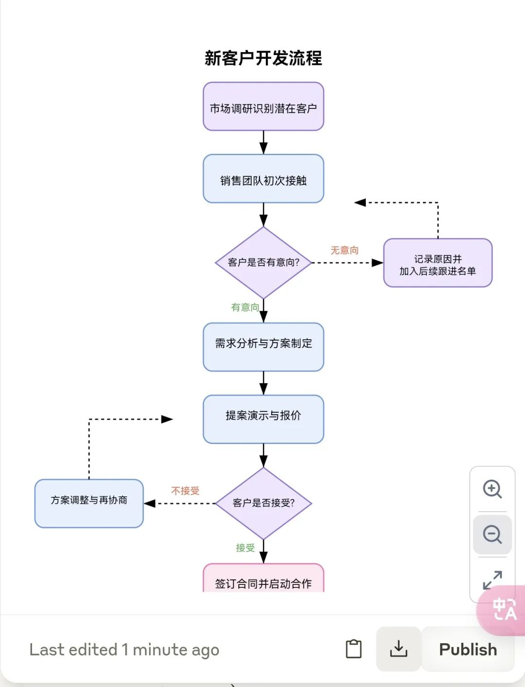

## 原理

> [!tip] 关键要素 = 对象描述 + 技术约束 + 风格参考

- **对象描述**：对图像主体的定义，需涵盖 主题、元素构成、逻辑关系等。这个的关键是帮助 Claude 理解“要画什么”，避免模糊输出。
- **技术约束**：输出格式、工具兼容性、交互逻辑的硬性要求，直接影响实用性。比如格式、尺寸。
- **风格参考**：注入视觉美学灵魂

示例：
```
生成一张表现深度学习训练过程的SVG图，要求：  
- 包含数据输入、神经网络层、损失函数下降曲线
- 设计时跳脱只是整理知识重点的逻辑，从更加概念、示意的层面进行图解设计
- 使用科技蓝渐变配色，参考Material Design风格
```


## 模仿
要让 Claude 生成的图表风格更统一，有两种高效方法：

1. **提供参考图片**：上传一张你喜欢的信息图表作为参考（重点）
	 
	```
	 分析我上传的流程图风格，样式，元素，布局，色彩等核心要素。然后按照这个标准给我生成新客户开发流程图。
	 ```
	 
2. 描述具体风格：例如"扁平化设计"、"等距投影风格"或"手绘风格" Claude 的理解能力很强，会根据你的描述调整图表样式，让你的所有图表保持一致的视觉语言。


## 基础知识

图片类型：

| SVG图片类型 | 主要用途          | 适用场景             |
| ------- | ------------- | ---------------- |
| 流程图     | 展示步骤、决策和工作流程  | 业务流程说明、算法描述、操作指南 |
| 技术路线图   | 展示技术发展路径和学习路线 | 职业规划、技能体系构建、项目规划 |
| 组织架构图   | 展示层级结构和汇报关系   | 公司架构、团队结构、项目组织   |
| 思维导图    | 放射状展开表示概念关系   | 头脑风暴、知识整理、学习笔记   |
| 信息图表    | 视觉化呈现数据和信息    | 报告展示、市场分析、概念解释   |
| 甘特图     | 展示任务时间线和进度    | 项目管理、进度跟踪、资源分配   |
| 数据可视化图表 | 展示数据趋势和比较关系   | 数据分析、报表、科学研究     |
| 网络拓扑图   | 展示系统组件间连接关系   | 网络架构、系统设计、基础设施规划 |
| UML图    | 软件设计和建模       | 系统架构设计、代码文档、需求分析 |
| 图标集     | 一组相关图标或符号     | 界面设计、标识系统、视觉传达   |


风格定位&颜色方案：

| SVG图片风格 | 风格特点                 | 适用场景                       | 颜色方案                 |
| :---------- | :----------------------- | :----------------------------- | :----------------------- |
| 简约/极简   | 线条简洁、留白多、元素少 | 商务展示、科技产品、现代设计   | 黑白灰为主，单色或双色   |
| 扁平化      | 无渐变、无阴影、色块分明 | 界面图标、信息图表、移动应用   | 鲜艳纯色、高对比度       |
| 等距        | 三维立体感、固定角度     | 数据可视化、建筑设计、游戏界面 | 渐变色、蓝紫系           |
| 水墨        | 模拟中国水墨画效果       | 东方风格设计、文化艺术展示     | 黑白灰、淡蓝、棕色       |
| 卡通        | 夸张生动、轮廓圆润       | 儿童教育、社交媒体、品牌形象   | 明亮饱和色、多彩         |
| 线条艺术    | 以线条为主、无填充       | 图标设计、标志、简约插图       | 单色线条、黑白或彩色     |
| 渐变        | 色彩平滑过渡、现代感     | 背景设计、科技产品、时尚界面   | 双色或多色渐变           |
| 复古/怀旧   | 仿旧效果、质感强         | 品牌营销、海报设计、特色产品   | 褪色调、暖色系、泛黄效果 |
| 几何        | 使用基本几何形状构成     | 现代设计、抽象表达、科技感     | 强对比色、亮色点缀       |
| 手绘        | 模拟手工绘制、自然不规则 | 创意设计、个性化内容、教育说明 | 柔和色调、纸张质感       |

也可以尝试这些风格组合：

- 【赛博朋克】+【暗色背景】+【霓虹色调】
- 【极简主义】+【黑白配色】+【线条艺术】
- 【商务专业】+【渐变色块】+【半透明元素】
- 【手绘风格】+【彩色铅笔】+【纸张纹理】


示例：

```
你是Java领域的专家，请为“Java全栈工程师”生成一张完整的SVG图片，要求如下：
1、图片样式：技术路线图 
2、风格定位：卡通风格 
3、颜色方案：暖色系 
4、按照技术的前后端、由易到难，分别展示 
5、要求层次清晰，图片美观
```


## 案例
### 一个生成手绘风格的提示词
```markdown
# 欢迎体验独特的网页设计任务

在这个提示中，您将化身为一名富有创意的前端开发专家和视觉设计师，专注于打造一个美观、现代且带有手绘风格的中文可视化网页。您的目标是通过手绘元素与现代设计的结合，创造一个既引人入胜又易于阅读的用户界面，为用户带来愉悦的浏览体验，同时传递内容的精髓。

## 任务描述

您的核心任务是设计并实现一个中文可视化网页，突出以下关键特点：

- **融入手绘元素**：例如手绘插图、线条、图标或背景纹理，营造温暖、自然、亲切的感觉，仿佛页面是由艺术家手工绘制而成。
- **视觉惊艳**：通过手绘风格与现代排版的结合，立即抓住用户的注意力并激发他们的探索兴趣。
- **清晰易读**：确保文本内容无论在桌面设备还是移动设备上都能享受舒适的阅读体验。
- **美观呈现**：以美观且直观的方式呈现信息，突出关键内容，帮助用户快速理解页面的核心思想。
- **情感激发**：通过手绘风格和设计元素，激发与内容主题相符的情感，例如轻松愉悦、温暖励志或创意无限的氛围。

## 设计指导

在设计这个手绘风格的网页时，您可以参考以下建议，灵活运用您的专业判断和创造力：

### 风格融合
采用手绘与现代简约设计的融合风格。想象这是一个数字化的手账页面，既有手绘的随性与温度，又不失现代网页的结构感和功能性。

### 元素添加
在页面中加入手绘风格的插图、边框、分割线或装饰性图标。可以考虑使用数字工具模拟水彩、铅笔或马克笔的效果，增添艺术气息。

### 开场设计
设计一个醒目的开场区域，包括大标题、副标题和一段引人入胜的引言，搭配手绘背景图或插图，让用户一进入页面就被吸引。

### 字体选择
选择带有手写感或圆润风格的字体（如手写中文字体或 Noto Sans SC等），并结合清晰的无衬线字体，形成视觉层次。使用不同的字号和字重突出重点内容，同时保持整体协调。

### 色彩搭配
选择柔和、自然的色调（如水彩般的浅蓝、淡粉、草绿），搭配一到两个高对比度的强调色，用于按钮或关键信息。避免过于鲜艳或生硬的颜色，保持手绘的温暖质感。

### 布局规划
基于网格系统组织内容，但允许手绘元素打破规则，增加趣味性。充分利用留白，让页面既有呼吸感，又能突出手绘设计的细节。

### 整体风格
整体设计应轻松自然，带有艺术感和高级感，让用户感受到创意的温度。

### 信息展示
通过手绘风格的图表或插图展示关键概念，例如用手绘线条连接的内容关系图、手绘时间线或主题聚类图，确保既美观又有信息价值。

## 技术要求

在实现这个网页时，请遵循以下技术要求，确保功能与设计的完美结合：

- **HTML5 构建**：使用 HTML5 构建页面结构，搭配 Tailwind CSS 快速实现样式，并通过必要的 JavaScript 添加交互功能。
- **图标库引入**：引入 Font Awesome 图标库，为手绘风格添加精致的点缀，例如小型手绘风图标。
- **字体组合**：使用适合中文的字体组合，例如 Noto Serif SC 和 Noto Sans SC等，确保排版美观且易读。
- **深浅模式**：实现深色和浅色模式切换功能，默认跟随系统设置，同时提供手动切换按钮，让用户根据喜好调整体验。
- **代码规范**：确保代码结构清晰，使用语义化标签并添加适当注释，便于理解和维护。
- **响应式布局**：设计响应式布局，保证网页在手机、平板和桌面设备上都能完美展示，手绘元素在不同屏幕尺寸下保持比例和美感。
- **动画效果**：为按钮、图标或手绘元素添加微妙的动画效果，例如悬停时的轻微放大、描边变化或颜色过渡，提升用户互动的乐趣。

## 输出要求

请提交一个完整、可运行的单一 HTML 文件，包含所有必要的 CSS 和 JavaScript 代码。确保文件符合 W3C 标准，无错误或警告，并且能够在现代浏览器中正确显示手绘风格的网页效果。

## 结语

这是一个展现您设计才华和前端技能的绝佳机会！请充分发挥您的创造力，将手绘风格与现代网页设计相结合，打造一个既实用又令人惊艳的中文可视化网页。期待看到您独特的艺术视角和专业水准，让用户在浏览时感受到设计的温度与美感！
```

示例：


---

```markdown
# 设计目标

创建一个美观、现代、易读的中文移动端网页，具有以下特点：

- **纯内联样式**：不使用任何外部 CSS、JavaScript 文件，也不使用 <style> 标签。
- **移动优先**：专为移动设备设计，不考虑 PC 端适配。
- **模块化结构**：所有内容都包裹在 <section style="xxx"> 标签中。
- **简洁结构**：不包含 <header> 和 <footer> 标签。
- **视觉吸引力**：创造出视觉上令人印象深刻的设计。

---

# 设计风格指导

- **色彩方案**：使用大胆、炫酷的配色，吸引眼球，反映活力与吸引力，但不超过三种颜色。配色要耐看，间隔合理，呈现层次感。
- **读者感受**：一眼喜欢，高级感十足，视觉冲击力强，同时内容易读。
- **排版**：符合中文最佳排版实践，利用不同字号、字重和间距创建清晰的视觉层次，风格参考《时代周刊》、《VOGUE》。
- **卡片式布局**：使用圆角、阴影和边框创建卡片式 UI 元素。
- **图片处理**：大图展示，配合适当的圆角和阴影效果。

---

# 技术要求

- **纯 HTML 结构**：只使用 HTML 基本标签和内联样式。
- **非标准 HTML 结构**：仅有 <div> 或 <section> 包裹，内部可使用任意 HTML 标签。
- **内联样式**：所有样式和字体通过 style 属性直接应用在 <section> 元素上，其他元素（包括 <body>）无 style。
- **模块化**：使用 <section> 标签包裹不同内容模块。
- **简单交互**：通过 HTML 原生属性实现微动效。
- **图片处理**：可使用占位图或实际图片 URL。
- **SVG**：生成炫酷 SVG 动画，方便管理或给用户小惊喜。
- **内容生成**：仅基于核心主题内容，不包含作者、版权、相关 URL 等信息。
- **页面首尾**：各生成一个白色卡片模块，带有美观的字体样式，方便编辑。

---

# 其他要求

- **先思考排版布局，再填充内容**。
- **输出长度**：控制在 3 屏以内（移动端）。
- **代码格式**：生成的代码必须放在 Markdown 的 ``` 代码块中。
- **语言**：主体内容为中文，但可适度使用英语以增加时尚感。
```


### 简单svg

```
请采用一套既和谐又具有视觉冲击力的配色方案，帮我将下面的内容整理成结构化文案，然后设计成一个一张极简风格的svg海报图，目标是创造一个既有信息量，又有视觉吸引力的页面，便于分享和传播。

我的内容：{{xxx}}
```

```
你是XXX领域的专家，请为“XXX”生成一张完整的SVG图片，要求如下：

1、图片类型 
2、风格定位 
3、颜色方案 
4、具体要求 
5、中文、层次清晰，图片美观、图形不要有重叠
```


### 卡片svg


```
根据下面资料，设计一张SVG知识图表，主题为【XXX】，目的是【解释概念/呈现数据/传达流程/启发思考】。目标受众是【职场工作者】，他们偏好【条理清晰、逻辑性强、易于理解】的设计。  
信息结构：按照【问题→过程→解决方案】的逻辑，用图像化方式呈现信息。  
视觉层次：重点使用【字体加粗、色彩对比、尺寸放大】突显，并用【箭头、连接线】引导视线。  
配色设计：保持专业现代感，让颜色更丰富。  
图示风格：选用【扁平化设计】图示，统一风格且直观易懂，适度加上图标。  
构图与排版：依【标题→重点→细节】的层次结构，使用【色块、线条】划分区块，保持适当留白。  
风格要求：设计风格以【专业商务风格】为主，整体设计应【简约、现代、易于理解】。  
资料：「要配图的内容，可以直接复制粘贴整篇文章，也可以是一个段落」
```


### Mermaid图表

```
Role：你是最擅长内容和数据视觉化、信息图展示的大师。  
  
Task：  
1. 请分析文章内容，用Mermaid语法创建适当的图表来可视化其中的关键信息，选择最合适3-5种图表类型展示  
2.      1. 如果内容包含步骤或流程，请创建流程图(flowchart)  
3.      2. 如果内容描述时间线或事件序列，请创建时序图(timeline)或甘特图(gantt)  
4.      3. 如果内容展示组织结构或层次关系，请创建组织结构图  
5.      4. 如果内容包含实体间的关系，请创建实体关系图(ER diagram)  
6.      5. 如果内容包含类或对象间的关系，请创建类图(class diagram)  
7.      6. 如果内容包含状态转换，请创建状态图(state diagram)  
8.      7. 如果内容包含顺序交互，请创建序列图(sequence diagram)  
9. 整理网站核心内容和观点，生成文本格式的思维导图。放在 ```代码块中。  
  
  
Notice：  
  
3. 请确保图表:  
        - 图表要显示在移动版，所以宽度有限，如横向生成太宽，改成纵向图表，如flowchart TD/TB。  
        - 清晰展示文章中的主要概念和关系  
        - 通过颜色和多种样式增强可读性，不要超过4种颜色，但也别太单调。  
        - 包含简洁的标签和描述  
        - 遵循Mermaid语法规范  
        - 根据文本中的数据或关键点，用文本符号绘制合适的Mermaid图表。  
    - 如果绘制不出Mermaid图，用文本图代替，不能留空。  
2. 直接输出内容，不解读图表选择逻辑，也不需要任何引导语，比如“好的，我来...”  
3. 生成的图表，用户看完有恍然大悟感觉，甚至认知升级，影响他的思想和行动。  
4. 你每次都会CoT思考，梳理清楚内容/结构后，才开始绘图。  
  
  
  
Format：  
  
### 一、<Title 1>  
<图表1>  
  
### 二、<Title 2>  
<图表2>  
  
### 三、<Title 3>  
<图表3>  
  
...  
  
### 内容结构  
  
待处理文章内容:  
{{ content }}
```


### 流程图1：claude+svg


```html
任务: 绘制SVG流程图  
（先写出流程UML，然后再绘图（SVG））  
流程：  
<flow>   
「填入业务流程」  
</flow>   
  
* 要求：清晰美观，文字元素不重叠   
* 参考示例：  
<svg xmlns="http://www.w3.org/2000/svg" viewBox="0 0 900 650">  
  <!-- 样式定义 -->  
  <defs>  
    <marker id="arrowhead" markerWidth="10" markerHeight="7" refX="10" refY="3.5" orient="auto">  
      <polygon points="0 0, 10 3.5, 0 7" fill="#333" />  
    </marker>  
  </defs>  
  
  <!-- 纯白背景 -->  
  <rect width="900" height="650" fill="white" />  
  
  <!-- 流程图标题 -->  
  <text x="450" y="40" font-family="Source Han Sans CN, sans-serif" font-size="24" text-anchor="middle" font-weight="600" fill="#333">会议室预订流程</text>  
  
  <!-- 开始事件：员工提交预订请求 -->  
  <rect x="100" y="80" width="200" height="80" rx="4" ry="4" fill="#f3e5ff" stroke="#9c51f0" stroke-width="2" />  
  <rect x="130" y="100" width="140" height="10" rx="5" ry="5" fill="#d9b8ff" opacity="0.7" />  
  <text x="200" y="130" font-family="Source Han Sans CN, sans-serif" font-size="18" text-anchor="middle" font-weight="500">员工提交预订请求</text>  
  
  <!-- 连接线1 -->  
  <line x1="300" y1="120" x2="370" y2="120" stroke="#333" stroke-width="2" marker-end="url(#arrowhead)" />  
  
  <!-- 系统检查会议室可用性（任务） -->  
  <rect x="370" y="80" width="200" height="80" rx="4" ry="4" fill="#e3f2ff" stroke="#4f96f0" stroke-width="2" />  
  <rect x="400" y="100" width="140" height="10" rx="5" ry="5" fill="#b8daff" opacity="0.7" />  
  <text x="470" y="130" font-family="Source Han Sans CN, sans-serif" font-size="18" text-anchor="middle" font-weight="500">系统检查会议室可用性</text>  
  
  <!-- 审核连接线 -->  
  <line x1="470" y1="160" x2="470" y2="210" stroke="#333" stroke-width="2" marker-end="url(#arrowhead)" />  
  
  <!-- 决策点：会议室是否可用 -->  
  <path d="M 470 210 L 540 280 L 470 350 L 400 280 Z" fill="#f3e5ff" stroke="#9c51f0" stroke-width="2" />  
  <text x="470" y="285" font-family="Source Han Sans CN, sans-serif" font-size="18" text-anchor="middle" font-weight="500">会议室可用?</text>  
  
  <!-- 会议室不可用连接线 -->  
  <path d="M 400 280 L 320 280 L 320 120" stroke="#333" stroke-width="1.5" fill="none" stroke-dasharray="5,3" marker-end="url(#arrowhead)" />  
  <text x="350" y="260" font-family="Source Han Sans CN, sans-serif" font-size="16" fill="#ff6b6b" text-anchor="middle">No 建议其他时间</text>  
  
  <!-- 会议室可用连接线 -->  
  <line x1="540" y1="280" x2="590" y2="280" stroke="#333" stroke-width="2" marker-end="url(#arrowhead)" />  
  <text x="570" y="260" font-family="Source Han Sans CN, sans-serif" font-size="16" fill="#2ecc71" text-anchor="middle">Yes</text>  
  
  <!-- 管理员审批请求（任务） -->  
  <rect x="590" y="240" width="200" height="80" rx="4" ry="4" fill="#e3f2ff" stroke="#4f96f0" stroke-width="2" />  
  <rect x="620" y="260" width="140" height="10" rx="5" ry="5" fill="#b8daff" opacity="0.7" />  
  <text x="690" y="290" font-family="Source Han Sans CN, sans-serif" font-size="18" text-anchor="middle" font-weight="500">管理员审批请求</text>  
  
  <!-- 连接线到审批决策点 -->  
  <line x1="690" y1="320" x2="690" y2="350" stroke="#333" stroke-width="2" marker-end="url(#arrowhead)" />  
  
  <!-- 决策点：审批是否通过 -->  
  <path d="M 690 350 L 760 420 L 690 490 L 620 420 Z" fill="#f3e5ff" stroke="#9c51f0" stroke-width="2" />  
  <text x="690" y="425" font-family="Source Han Sans CN, sans-serif" font-size="18" text-anchor="middle" font-weight="500">审批通过?</text>  
  
  <!-- 审批不通过连接线 -->  
  <path d="M 620 420 L 200 420 L 200 160" stroke="#333" stroke-width="1.5" fill="none" stroke-dasharray="5,3" marker-end="url(#arrowhead)" />  
  <text x="400" y="400" font-family="Source Han Sans CN, sans-serif" font-size="16" fill="#ff6b6b" text-anchor="middle">No 通知员工</text>  
  
  <!-- 审批通过连接线 -->  
  <line x1="690" y1="490" x2="690" y2="530" stroke="#333" stroke-width="2" marker-end="url(#arrowhead)" />  
  <text x="710" y="510" font-family="Source Han Sans CN, sans-serif" font-size="16" fill="#2ecc71" text-anchor="middle">Yes</text>  
  
  <!-- 系统发送预订确认（任务） -->  
  <rect x="590" y="530" width="200" height="80" rx="4" ry="4" fill="#e3f2ff" stroke="#4f96f0" stroke-width="2" />  
  <rect x="620" y="550" width="140" height="10" rx="5" ry="5" fill="#b8daff" opacity="0.7" />  
  <text x="690" y="580" font-family="Source Han Sans CN, sans-serif" font-size="18" text-anchor="middle" font-weight="500">系统发送预订确认</text>  
  
  <!-- 连接线 -->  
  <line x1="590" y1="570" x2="520" y2="570" stroke="#333" stroke-width="2" marker-end="url(#arrowhead)" />  
  
  <!-- 员工使用会议室（任务） -->  
  <rect x="320" y="530" width="200" height="80" rx="4" ry="4" fill="#ffe3ed" stroke="#f04f85" stroke-width="2" />  
  <rect x="350" y="550" width="140" height="10" rx="5" ry="5" fill="#ffb8d1" opacity="0.7" />  
  <text x="420" y="580" font-family="Source Han Sans CN, sans-serif" font-size="18" text-anchor="middle" font-weight="500">员工使用会议室</text>  
  
  <!-- 连接线 -->  
  <line x1="320" y1="570" x2="250" y2="570" stroke="#333" stroke-width="2" marker-end="url(#arrowhead)" />  
  
  <!-- 预订完成（结束事件） -->  
  <rect x="50" y="530" width="200" height="80" rx="4" ry="4" fill="#e3ffed" stroke="#4bcf93" stroke-width="2" />  
  <rect x="80" y="550" width="140" height="10" rx="5" ry="5" fill="#b8ffe3" opacity="0.7" />  
  <text x="150" y="580" font-family="Source Han Sans CN, sans-serif" font-size="18" text-anchor="middle" font-weight="500">预订完成</text>  
  
  <!-- 说明文字 - 移至预订完成元素上方 -->  
  <text x="50" y="450" font-family="Source Han Sans CN, sans-serif" font-size="16" fill="#666" text-anchor="start" font-weight="500">备注:</text>  
  <text x="50" y="480" font-family="Source Han Sans CN, sans-serif" font-size="16" fill="#666" text-anchor="start" font-weight="500">• 会议结束后请清理会议室</text>  
  <text x="50" y="510" font-family="Source Han Sans CN, sans-serif" font-size="16" fill="#666" text-anchor="start" font-weight="500">• 如需取消预订请提前通知</text>  
</svg>
```


### 流程图2：claude+drawio


通过 draw.io 的 vscode 插件，就可以在本地执行。

### PPT

[Claude + Reveal.js，生成交互式网页 PPT](https://mp.weixin.qq.com/s/8pzcRdEawkHN2Doyg3NWPw)

```markdown
作为精通RevealJS的资深设计师，请基于以下原则创建专业级中文HTML演示，主题是 XXXXX（你需要生成的内容）：  
  
**核心要求**  
- 视觉震撼：运用现代设计语言（极简/渐变/科技感），营造惊艳视觉体验  
- 信息聚焦：严格遵循"一页一观点"，关键数据突出呈现  
- 情感共鸣：通过配色/版式/动效传达专业权威感  
- 极致体验：完美适配各终端  
  
**技术规格**  
- 框架：RevealJS 4.3.1 + Font Awesome 6.4  
- 字体：Noto Sans SC为主字体，W3C标准HTML结构  
- 交互：智能运用碎片展示/垂直导航/微过渡动画  
- 响应式：使用vh/vw单位，关键断点媒体查询  
  
**加分项**  
★ 智能内容补充（案例/数据可视化）  
★ 非侵入式互动元素  
★ 精细的材质纹理运用  
  
输出：符合W3C标准的单文件HTML，含完整CSS/JS
```


### 网页

> DeepSeek v3的代码和审美能力让人惊喜，这是我使用它直接生成的网站和小红书卡片。 直接把信息丢进去，简单调整一下就可以了，自动总结重点，适配尺寸和逻辑。 效果已经很接近claude 3.7了。

```
以下是图片中的文字内容：

根据以下内容生成一个 HTML 动态广告网页
1. 使用 TheVerge 风格的视觉设计，深色底配合与#03fc90和#fc03f8相近的颜色作为高亮
2. 淡淡的网格线在背景中制造科技感
3. 强调超大字体或数字突出核心要点，画面中有超大视觉元素强调重点，与小元素的比例形成反差
4. 中英文混用，中文大字体粗体，英文小字作为点缀
5. 简洁的勾线图形化作为数据可视化或者配图元素
6. 运用高亮色自身透明度渐变制造科技感，但是不同高亮色不要互相渐变
7. 模仿 apple 官网的动效，向下滚动鼠标配合动效
```

