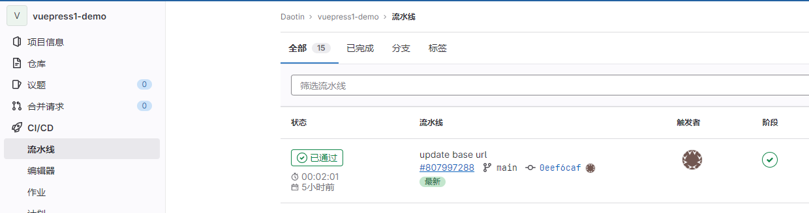

# CICD 从入门到实践

## 前端部署

部署（Deploy）指的是将构建后的新版本应用或者服务安装到目标环境（开发、测试或者生成）中。在前端项目中，部署相对简单，一般指的是将构建好的静态资源文件放在服务器上。

那么接下来我们看下，传统的手动部署方案和自动化部署方案的流程以及其对比。

### 手动部署

手动部署，顾名思义，就是我们手动将构建后的产物上传至目标服务器。其流程大致如下：


1.  源码构建：在项目中执行构建命令，一般为 `npm run build`，在发布前的构建环节，我们一般会获取生成环境的配置信息然后进行编译\构建过程（代码效验、代码压缩、自动化测试等操作），最终生成可上线的构建产物。
2.  连接服务器：使用 FTP 或者 SSH 工具连接服务器。
3.  上传资源：将构建后的产物上传至相应的目录。
4.  重启 nginx。

手动部署的优点和缺点都是显而易见的：

- 优点就是简单、门槛低，我们可以直接将构建产物拖动上传到服务器就完成了部署和发布的过程。
- 缺点就是效率低下，流程规范和稳定性差，并且安全风险高，无法回滚等。

### 自动化部署

每个人使用手动部署的方式不好管理，也容易冲突，所以现在都会用专门的平台来做这件事构建和部署，比如 jenkins。我们代码会提交到 gitlab 等代码库，然后 jenkins 从这些代码库里把代码下载下来进行 build，再把产物上传到服务器上。

流程和直接在本地构建上传差不多，只不过这样方便管理冲突、历史等，还可以跨项目复用一些东西。


构建、部署的过程最开始是通过 shell 来写，但写那个 shell 还是比较麻烦的。后来就支持了可视化的编排，可以被编排的这个构建、部署的流程叫做流水线 `pipeline`。比如 Jenkins 就是专门做 CI/CD 的 平台。

jenkins 支持 pipeline 的可视化编排，比写 shell 脚本的方式易用很多，可以在构建过程中加入自动化测试、静态代码检查等步骤。


除了构建、部署外，也可以加入一些自动化测试、静态代码检查等任务。&#x20;

这种自动化的构建、部署流程就叫做 CICD（持续集成和持续部署）。

现在，我们**把构建、部署的流程管理了起来**，但是不同代码的运行环境是不同的，比如 Node.js 服务需要安装 node，Java 服务需要安装 JRE 等，只把代码传上去并不一定能跑起来。

于是，我们还需要**把环境管理起来**。所以，现在的构建产物不再是直接上传服务器，而是生成一个 docker 镜像，上传到 docker 仓库，然后把这个 docker 镜像部署到服务器。


**总结**

自动化部署流程如下：

1.  获取代码：首先我们需要从远程仓库拉取最新的代码。在获取完代码之后我们还可以进行对代码的安全检查和单元测试的操作。
2.  安装依赖：然后需要安装项目构建时所需要的依赖包为后面构建环节做准备。
3.  构建源码：在获取完依赖之后，我们就需要对源码就行构建操作，生成构建产物。在构建完成之后，我们可以对构建后的产物进行检查，比如资源文件是不是过大等。
4.  上传资源：在源码构建完毕之后我们就可以将构建产物上传至服务器或者 CDN。
5.  通过构建完成：最后，最好有触达通知我们构建完成，本次自动化部署才算真正完成。

## CICD 简介

### 基本概念

CICD 包括 1 个 `CI` 和 2 个 `CD`。

CI 指持续集成（Continuous Integration），CD 指持续交付（Continuous Delivery）和 持续部署（Continuous Deployment），是一种软件开发实践。意思是通过一系列自动化的脚本执行，实现开发过程中的代码的交付和部署，能够快速交付，提高团队开发的效率。

### 持续集成

就是当将代码提交到版本控制系统时，能够**自动化地进行构建、测试等操作以验证代码的质量**。而不是独立地开发每个功能模块并在开发周期结束时一一提交。

每次集成都会通过自动化的构建（包括编译、发布、自动化测试等）来验证代码的质量，从而尽早地发现和修复问题。这样可以减少开发过程中的错误和问题，提高软件的质量。

举个例子，想象一个班级里的小朋友们正在一起搭建一个大型积木城堡。每个小朋友负责搭建城堡的一部分。为了确保每个部分都能很好地组合在一起，他们需要经常把各自的部分拼接在一起，检查是否有问题。这样，如果发现某个部分有问题，他们可以尽早修改，避免最后城堡搭建完成时发现问题，需要拆掉整个城堡重新搭建。

在软件开发中，持续集成就是这样一个过程，它帮助开发团队更高效地协作，确保软件的质量和稳定性。

以下是持续集成的一般流程：

**1、提交代码后自动触发 CI 流程**

- 发人员在自己的分支上开发并提交代码；
- CI 服务器会自动通过 webhook 检测到代码变更，自动触发 CI 流程；

**2、进行代码质量检测和构建**

- 然后会进行静态代码检测，通常是进行一些快速的错误检查过程，比如语法检查，如果有错误就直接终止流程。
- 进行完基础的代码检查之后，会进入自动构建环节，比如要进行代码效验、代码压缩、自动化测试等操作。
- 构建完成之后，会进行一些回归测试、自动化测试、集成测试以及压力测试等。
- 如果构建失败，CI 服务器会发送通知，开发人员可以通过构建报告、日志和版本控制系统等方式定位问题。
- 开发人员在定位问题后，需要及时解决问题并重新提交代码。
- 重复以上步骤，直到测试通过。

**3、测试构建通过，则合并到主分支**

- 如果测试通过，CI 服务器会自动将代码合并到主干分支；
- CI 服务器会再次对主干代码进行编译、测试；
- 如果测试通过，CI 服务器会将代码部署到预发布环境供测试人员测试。

### 持续交付

持续交付在持续集成的基础上，在构建成功后，自动化部署工具会将应用程序或镜像交付给 QA。

### 持续部署

持续部署（Continuous Deployment，简称 CD）是一种软件开发实践，**它要求在通过持续集成（CI）验证代码质量后，自动将代码部署到测试环境。**这样可以确保软件的新功能和修复迅速地推向用户，提高开发效率和响应速度。

让我们用一个简单的例子来解释持续部署：想象一个餐厅，厨师们不断地烹饪新的菜肴。在持续集成阶段，每道菜都会经过严格的品尝和检查，确保口味和质量。持续部署就好比是将这些菜肴迅速地送到顾客的餐桌上，让顾客尽快品尝到美味的菜肴。这样一来，厨师们可以快速地了解顾客的反馈，根据反馈改进菜肴，提高顾客满意度。

在软件开发中，持续部署可以帮助开发团队更快地将新功能和修复推向用户，并根据用户反馈进行优化。这有助于提高软件质量和用户体验，同时提高开发团队的工作效率。

::: details ❓ 持续交付和持续部署的区别是什么？

由于在实际的项目开发中，我们一般不会持续部署到生产环境，因为还未进行全方位的人工测试，所以我们**一般都会自动化部署到开发或者测试环境**，然后再经过自动化测试，或者人工测试通过后，再手动部署到生产环境。那么这个时候，我们的流程其实叫持续交付，而不是持续部署。

持续交付（Continuous Delivery，简称 CD）和持续部署（Continuous Deployment，也简称 CD）都是软件开发的实践，它们的目标是加速软件开发过程中的发布和部署。尽管它们的名称相似，但它们之间还是有一些关键区别的。

持续交付是指在持续集成的基础上，将软件的新版本自动推送到预生产或类生产环境，使得每个版本都可以随时部署到生产环境。在持续交付过程中，软件的发布需要经过人工审批，也就是说，开发团队可以决定何时将软件部署到生产环境。这为团队提供了一定程度的控制，以便在发布之前进行额外的测试或准备工作。

持续部署则是持续交付的自动化版本。在持续部署中，一旦代码通过了自动化测试和预生产环境的验证，它将自动部署到生产环境，而无需人工干预。这意味着软件的新功能和修复可以更快地推向用户，提高开发效率和响应速度。

总结一下，持续交付和持续部署的主要区别在于部署到生产环境的过程是否自动化。持续交付需要人工审批并决定何时将软件部署到生产环境，而持续部署则完全自动化，无需人工干预。

:::

::: details ❓ 持续部署的过程没有经过测试人员的手工测试就直接部署到生产环境了吗？那岂不是不够安全？

在持续部署的过程中，虽然没有经过测试人员的手工测试，但在部署到生产环境之前，代码会经过一系列自动化测试。这些自动化测试包括单元测试、集成测试、系统测试和性能测试等，以确保代码的质量和性能。自动化测试可以在很大程度上保证软件的安全性和稳定性。

然而，自动化测试可能无法覆盖所有的测试场景，特别是一些复杂的、需要人工判断的场景。因此，在实际应用中，持续部署的策略通常取决于项目的需求和团队的经验。有些团队可能会选择在关键功能或者高风险变更上进行额外的手动测试，以确保软件的质量。

总之，持续部署的过程确实存在一定的风险，但通过结合自动化测试和适当的手动测试，可以在很大程度上降低风险。关键在于找到适合项目和团队的平衡点，以实现快速、安全的软件发布。

:::

::: details ❓ 如果加入了手动测试，是否就变成了持续交付而不是持续部署了？

是的，如果在部署过程中加入了手动测试并需要人工审批，那么这个过程就更接近于持续交付而不是持续部署。持续交付允许开发团队在将软件部署到生产环境之前进行额外的手动测试和审批，从而确保软件的质量和安全性。

持续部署强调的是自动化部署到生产环境，而持续交付则为团队提供了更多的灵活性和控制权，以便在部署之前进行必要的手动测试和准备工作。实际上，很多团队会根据项目需求和风险评估，选择在持续部署和持续交付之间进行权衡和调整。

:::

### 使用场景

CICD 的使用场景可以是：

1.  团队开发：多人协作开发时，CICD 可以自动化合并代码、运行测试、构建和部署等操作，提高团队开发效率和协作质量。
2.  快速交付：对于需要频繁发布更新的应用，如移动应用、Web 应用、游戏等，采用 CICD 可以使发布流程更快捷、更稳定，缩短交付周期，提高用户满意度。
3.  质量保证：CICD 可以自动化运行测试、代码检查等过程，发现潜在问题和错误，提高软件质量和稳定性。
4.  系统集成：对于需要集成多个系统和服务的复杂应用，CICD 可以自动化进行集成测试和部署，提高整个系统的稳定性和一致性。

总之，CICD 适用于需要频繁更新、稳定性要求高、快速交付的应用开发和运维场景，可以提高开发效率、软件质量和用户满意度。

### 发展历史

CICD 的发展历史可以概括为以下几个阶段：

1.  手动部署阶段：在软件开发的早期阶段，软件部署是一项繁琐的手动任务。开发人员需要手动将代码打包、上传和部署到生产环境中，这种方式容易出错且效率低下。
2.  自动化构建和部署阶段：随着自动化构建工具（如 Maven、Gradle 等）和自动化部署工具（如 Shell 脚本、Puppet、Chef 等）的出现，使得软件构建和部署变得更加简单和高效。
3.  持续集成阶段：随着代码库变得越来越复杂，需要更好的协作方式。CICD 的概念由 Martin Fowler 提出。

### 优缺点

优点：

1.  自动化：CICD 可以自动化构建、测试、发布等流程，减少人工干预，提高效率。
2.  快速反馈：CICD 能够快速反馈开发人员在代码编写、集成、测试等环节中存在的问题，从而提高软件的质量和稳定性。
3.  可重复性：CICD 流程中的自动化能够确保每次构建都是相同的，避免了人为因素对软件质量的影响。
4.  稳定性：CICD 可以提高发布过程的稳定性，降低发布时的风险，减少因发布引起的故障和影响。
5.  效率：CICD 的自动化和可重复性能够提高开发和测试效率，减少重复劳动，节约时间和成本。

缺点：

1.  实现成本高：CICD 需要大量的技术和资源投入，包括构建、测试、集成、部署等方面的工具、硬件、人员等，实现成本较高。
2.  学习成本高：CICD 需要开发人员具备一定的技术和工具使用能力，需要学习新的工具和方法，学习成本较高。
3.  安全问题：CICD 在自动化流程中可能会存在一些安全问题，如自动化测试环节可能会导致敏感数据泄露等问题，需要加强安全控制和审查。
4.  难以应对复杂场景：CICD 在应对一些复杂场景时可能比较困难，需要投入更多的资源和精力进行开发和测试。
5.  可能会出现误报：CICD 的自动化测试可能会出现误报，导致无效的发布回滚，需要进行一定的人工干预和判断。

## CICD 实战

### 工具选择

目前主流的 CICD 工具和平台有很多，以下列举一些比较常见的：

1.  **Jenkins**：是目前最流行的开源 CICD 工具之一，可以自动化执行各种任务，包括构建、测试和部署软件，具有丰富的插件和可扩展性，能够支持各种编程语言和应用程序。但是，需要用户自己维护和管理，对于初学者来说可能有一定的学习曲线。
2.  **GitLab CI**：是 GitLab 平台自带的 CICD 工具，可以轻松地集成到 GitLab 代码库中，支持自动构建、测试和部署。你只需要在你项目中的根目录下加上 `.gitlab-ci.yml` 包含构建、测试和部署的脚本即可。GitLab 如果检测到仓库中有该文件，就会使用 `Gitlab Runner` 工具按照顺序运行你设置的构建、测试和部署的脚本。它的优点是易于设置和管理，缺点是对于大规模的项目可能不太适用。
3.  **GitHub Actions**：是 GitHub 平台自带的 CICD 工具，可以轻松地集成到 GitHub 代码库中，支持自动化构建、测试和部署。它的优点是免费、易于设置和管理，缺点是对于大规模的项目可能不太适用。

::: info 💡 那么什么是 Github Action 中的 Action 呢？

在 CI/CD 中，比如抓取代码、运行测试、发布第三方服务等，这一个个操作点就是一个个的 Action。

这些 Action 操作是可以在多个项目中共享的，所以 Github 允许开发者将不同的操作也就是 action 处理为独立的脚本文件，放在 github action 平台上供其他开发者共享使用。同样的，如果你需要某个需求，也可以再 github 上找到同样公共的 action 即可。这样，CI/CD 流程就变成了一个个 action 的集合。

功能特点：

- `workflow`：在 github action 中，每一次 CI/CD 的过程就是一个 workflow。
- `job`：一个 workflow 可以包含多个 job 任务。
- `step`：每个 job 由多个 step 构成。
- `action`：每个 step 可以依次执行一个或者多个 action。
- `社区支持`：github action 有着很好的社区支持，社区提供了众多的 action 可供选择。
- `收费方式`：GitHub 中公开的仓库免费，对于私有仓库提供一定的免费执行时间和空间，超出部分收费。

参考：

- [GitHub Actions 入门教程](https://www.ruanyifeng.com/blog/2019/09/getting-started-with-github-actions.html "GitHub Actions 入门教程")
- 操作手册：[https://juejin.cn/post/7156957907890733063#heading-75](https://juejin.cn/post/7156957907890733063#heading-75 "https://juejin.cn/post/7156957907890733063#heading-75")

:::

此外，还有 Travis CI，Circle CI 等工具。

### 使用 Github Action 实现自动部署 Vuepress 静态网站

**Github Actions**是基于`Github`的`持续集成服务`。其提供一台虚拟`服务器实例`，在该实例中允许通过自定义`Actions`执行一个或多个命令，以自动地操作代码、构建代码、测试代码、打包代码、发布代码、部署代码、登录远程服务器等。

**Github Actions 配置文件的常见字段：**

- `name`表示工作名称，若不设置默认为`workflow文件`的文件名称。
- `on`表示触发事件，上述提到的`Webhooks`可定义一个或多个`Webhooks`，通常是`push`与`pull_request`。`Webhooks`要指定操作的分支，通常是`master`或`main`。
- `jobs`表示任务列表，使用对象表示，对象属性表示任务名称，会在`Actions`的执行时显示。
  - **`name`**：任务名称
  - **`runs-on`**：虚拟机环境，可选`ubuntu-latest/windows-latest/macos-latest`
  - **`needs`**：执行任务的依赖顺序
  - **`steps`**：执行步骤，每个任务可将需执行的内容划分为不同步骤
    - `name`：步骤名称
    - `uses`：官方与第三方`Actions`
    - `with`：`Actions`的入参
    - `run`：执行命令
    - `env`：环境变量

#### 基于 Github 提供的持续集成服务部署一个静态站点

1、生成一个 Github Token

打开 Github 设置，点击 Developer settings，再点击 Personal access tokens，再点击 Generate new token。在 Note 中输入备注信息，例如 GA_TOKEN。在 Select scopes 中选择 repo 与 workflow。


2、在项目仓库中创建 Actions Secret（比如`VUEPRESS_GA_TOKEN`）


3、编写 Github Actions 配置文件

在项目根目录中创建 `.github/workflow/deploy.yml`文件。

示例代码：

```yaml
name: Deploy to GitHub Pages

on:
  push:
    branches:
      - main

# 这里定义了一个作业deploy，该作业运行在ubuntu-latest操作系统上。作业中包含了三个步骤：

# 1、使用actions/checkout action来checkout代码；
# 2、设置node版本；
# 3、安装依赖并构建项目；
# 4、使用peaceiris/actions-gh-pages action来将构建好的文件发布到gh-pages分支上。
jobs:
  deploy: #任务名称
    runs-on: ubuntu-latest
    steps:
      - name: Checkout
        uses: actions/checkout@v2

      - name: Set Node Version
        uses: actions/setup-node@v3
        with:
          node-version: 16
          cache: npm

      - name: Install and build
        run: npm install && npm run build

      - name: Deploy
        uses: peaceiris/actions-gh-pages@v3
        with:
          personal_token: ${{ secrets.VUEPRESS_GA_TOKEN }}
          publish_dir: ./docs/.vuepress/dist
```

当该 Github Action 运行后，**会自动生成 gh-pages 分支**。

4、然后，在设置中的 pages 界面，就可以看到已经部署在 gh-pagse 分支了。所以**千万不要手动新建 gh-pages 分支**，否则构建后的 dist 内容无法放在 gh-pages 分支中。

5、后续，当有内容 push 到 main 分支的时候，都会自动构建并发布到 gh-pages 分支。

### 使用 Gitlab CI 工具实现 CICD 流程

操作步骤

1.  在 `docs/.vuepress/config.js` 中设置正确的 `base`。

    如果你打算发布到 `https://<USERNAME or GROUP>.gitlab.io/`，则可以省略这一步，因为 `base` 默认即是 `"/"`。

    如果你打算发布到 `https://<USERNAME or GROUP>.gitlab.io/<REPO>/`（也就是说你的仓库在 `https://gitlab.com/<USERNAME>/<REPO>`），则将 `base` 设置为 `"/<REPO>/"`。

2.  在 `.vuepress/config.js` 中将 `dest` 设置为 `public`。
3.  在你项目的根目录下创建一个名为 `.gitlab-ci.yml` 的文件，无论何时你提交了更改，它都会帮助你自动构建和部署：

```yaml
image: node:14

pages:
  cache:
    paths:
      - node_modules/

  script:
    - yarn install # npm install
    - yarn build # npm run docs:build
  artifacts:
    paths:
      - public
  only:
    - main
```

1.  然后在“流水线”中就可以看到构建的进度：



1.  最后在“部署”-“Pages”页面，就可以看到部署成功后的页面链接。


> **注意：由于 Gitlab Pages 默认会部署在`public`文件夹，所以我们需要将 dest 输出到根目录下的 public 文件夹。**

我之前没有设置 dest，然后使用的是下面的代码：

```yaml
script:
  - yarn install # npm install
  - yarn build # npm run docs:build
  - mkdir public
  - mv ./docs/.vuepress/dist public
```

按理来说，也是可以的部署成功的，结果流水线是通过的，但是“部署”-“Pages”一直没有出现链接，目前还没找到原因。

::: tip **_(added in 20230405)_**

经过请教 ChatGPT 老师，我找到了答案：

你的写法是将整个`./docs/.vuepress/dist`文件夹移动到`public`文件夹，而不是将`dist`文件夹中的内容移动到`public`文件夹。这样会导致文件结构不正确，GitLab Pages 可能无法正确部署你的项目。为了解决这个问题，你应该将`dist`文件夹中的内容移动到`public`文件夹，而不是整个文件夹。你可以使用以下命令：

```bash
mv ./docs/.vuepress/dist/* public/
```

这个命令会将`./docs/.vuepress/dist`文件夹中的所有内容移动到`public`文件夹，而不是整个文件夹。这样，GitLab Pages 应该能够正确部署你的项目。

:::

官方文档：[https://docs.gitlab.cn/jh/ci/yaml/](https://docs.gitlab.cn/jh/ci/yaml/ "https://docs.gitlab.cn/jh/ci/yaml/")

### 使用 Jenkins 实现 CICD 流程

从 Github Action 和 Gitlab CI 可以看出，各个代码仓库都有一套自己的 CICD 工作流，但是并不是通用的，就像 Github Action 的不能在 Gitlab 上使用一样。

那么，有没有一套 CICD 工具，可以使用在任何代码仓库或者自建的仓库呢？答案就是 Jenkins。

Jenkins 是一款开源 CI\&CD 软件，用于自动化各种任务，包括构建、测试和部署软件，能够满足任何项目的需要。

Jenkins 工具的特点：

- 支持持续集成和持续交付
- 简易安装，跨平台
- 配置简单，可以通过可视化界面轻松设置和配置
- 超过 1000 多个插件，满足项目的任何需要
- 可以通过其插件架构进行扩展
- 可以轻松地在多台机器上分配工作，可以方便跨平台构建、测试和部署。

官方文档：[https://www.jenkins.io/zh/doc/#doc/pipeline/tour/getting-started#](https://www.jenkins.io/zh/doc/#doc/pipeline/tour/getting-started# "https://www.jenkins.io/zh/doc/#doc/pipeline/tour/getting-started#")

#### Jenkins 安装

通过 Docker 安装 Jenkins 2.346.3

::: details ❓ `jenkins/jenkins`和`jenkinsci/blueocean`都是 Jenkins 的官方 Docker 镜像，但是它们有一些不同之处。

jenkins/jenkins 是 Jenkins 核心的 Docker 镜像，它包含了 Jenkins 本身的安装文件和运行所需的环境。这个镜像提供了 Jenkins 的基础功能，但是不包括其他插件和工具。

jenkinsci/blueocean 则是基于 jenkins/jenkins 镜像构建的，它包含了 Jenkins 核心以及 Blue Ocean 插件。Blue Ocean 是一个 Jenkins 开发的全新的 Web 界面，提供了更直观、更易用的界面来展示构建、部署等信息。Blue Ocean 还提供了流水线编辑器、内置的可视化工具等功能，使得 Jenkins 在持续集成、交付、部署（CI/CD）方面更加强大和易用。

因此，jenkins/jenkins 相当于 Jenkins 的基础环境，而 jenkinsci/blueocean 则是在 jenkins/jenkins 基础上添加了 Blue Ocean 插件，提供了更多的功能和易用性。如果你需要使用 Blue Ocean 插件，那么使用 jenkinsci/blueocean 镜像会更加方便和高效。

下面就是 jenkinsci/blueocean 的可视化配置界面：


参考：

- [https://developer.aliyun.com/article/892646](https://developer.aliyun.com/article/892646 "https://developer.aliyun.com/article/892646")
- [https://www.cnblogs.com/esofar/p/11163583.html](https://www.cnblogs.com/esofar/p/11163583.html "https://www.cnblogs.com/esofar/p/11163583.html")

:::

具体步骤如下：

1、**确保 CentOS 系统已经安装了 Docker。**

2、**使用如下命令拉取 Jenkins 的 Docker 镜像：**

```bash
docker pull jenkins/jenkins
```

3、**创建用于 Jenkins 持久化存储的目录：**

```bash
mkdir -p /usr/local/jenkins

```

**4、通过如下命令创建并启动 Jenkins 容器**

```bash
docker run -d -p 8099:8080 -p 50099:50000 -v /usr/local/jenkins:/var/jenkins_home -v /usr/bin/docker:/usr/bin/docker -v /var/run/docker.sock:/var/run/docker.sock --name myjenkins-con jenkins/jenkins

```

```bash
# 写成换行的形式如下
docker run \
  -d \
  -p 8099:8080 \
  -p 50099:50000 \
  -v /usr/local/jenkins:/var/jenkins_home \
  -v /usr/bin/docker:/usr/bin/docker \
  -v /var/run/docker.sock:/var/run/docker.sock \
  --name myjenkins-con \
  jenkins/jenkins

```

以下是每个选项的含义：

- `-d`: 指定容器在后台运行（以“守护进程”模式运行）
- `-p 8099:8080`: 将主机端口 8099 映射到容器内部的端口 8080。这允许从主机访问容器中运行的 Jenkins 服务器。
- `-p 50099:50000`: 将主机端口 50099 映射到容器内部的端口 50000。这是用于构建代理的端口，可以使 Jenkins 从容器外部运行构建代理。
- `-v /var/run/docker.sock:/var/run/docker.sock`: 挂载 Docker 宿主机的 Unix 套接字文件/var/run/docker.sock 到容器内的同一文件，以便容器可以与宿主机上的 Docker 守护进程通信。这允许容器启动其他容器。
- `-v /usr/bin/docker:/usr/bin/docker`：把 Docker 二进制文件从主机挂载到容器，并允许容器执行 Docker 命令。
- `-v /usr/local/jenkins:/var/jenkins_home`: 将主机上的目录/usr/local/jenkins 挂载到容器内的目录/var/jenkins_home。这允许 Jenkins 服务器的配置和数据持久化。
- `--name myjenkins`: 将容器命名为“myjenkins”。这使得容器可以通过名称来引用，而不是通过容器 ID。
- `jenkins/jenkins`: 基于此镜像启动容器。该镜像是一个包含 Jenkins 服务器和其他工具的完整环境。

查看容器是否启动成功：

```bash
[root@daotin-aliyun ~]# docker ps
CONTAINER ID   IMAGE                 COMMAND                  CREATED         STATUS         PORTS                                                                                      NAMES
9dbfc89c60ed   jenkinsci/blueocean   "/sbin/tini -- /usr/…"   9 seconds ago   Up 8 seconds   0.0.0.0:8099->8080/tcp, :::8099->8080/tcp, 0.0.0.0:50099->50000/tcp, :::50099->50000/tcp   myjenkins
```

::: details ❓ 通过 docker ps 查看，发现容器未成功启动

在运行`docker run`命令时，使用`:z`或`:Z`选项来设置卷的安全标签。这将允许容器访问卷，例如：

```bash
sudo docker run -d -p 8099:8080 -p 50099:50000 -v /usr/local/jenkins:/var/jenkins_home:z -v /usr/bin/docker:/usr/bin/docker -v /var/run/docker.sock:/var/run/docker.sock --name myjenkins-con jenkins/jenkins
```

使用`:z`选项可以在多个容器之间共享卷，而`:Z`选项将使卷仅对当前容器可用。请注意，这可能会更改你主机上的文件安全上下文（SELinux 标签），因此请谨慎使用。

:::

::: details ❓ 启动 jenkins 时，报错`docker: Error response from daemon`

```bash
docker: Error response from daemon: driver failed programming external connectivity on endpoint myjenkins (c5bcd8806264b30ee8cb6b3f41851ee91b6462081d227e479993a4275cb3d6fd):
(iptables failed: iptables --wait -t nat -A DOCKER -p tcp -d 0/0 --dport 50099 -j DNAT --to-destination 172.17.0.4:50000 ! -i docker0: iptables: No chain/target/match by that name.
 (exit status 1)).
```

解决：需要重启 docker：`sudo systemctl restart docker`

参考：[https://blog.csdn.net/whatday/article/details/86762264](https://blog.csdn.net/whatday/article/details/86762264 "https://blog.csdn.net/whatday/article/details/86762264")

:::

**5、在 Web 浏览器中输入以下 URL 以访问 Jenkins：**

```bash
http://<公网IP>:8099

```

**6、在初始登录页面上，输入初始密码**

该密码存储在容器中的文件`/var/jenkins_home/secrets/initialAdminPassword` 中。复制并粘贴该密码，然后单击"Continue"继续。

```bash
cat /var/jenkins_home/secrets/initialAdminPassword

```

将输出管理员密码，将其复制并粘贴到 Jenkins 网页中，并单击“继续”按钮。

**遇到的问题**

::: details ❓ 如果提示不存在文件 initialAdminPassword

则可以使用指令：`docker logs myjenkins-con` ，然后在 log 中能发现密码。


:::

**7、安装插件**

在下一个屏幕，你将会被问到是否想安装建议的插件，还是自己选择插件安装。点击”安装建议的插件“，安装过程将会开始。


最后，一旦安装完成，你将会被提示设置 Jenkins 管理员帐户和 URL，然后单击“保存并继续”按钮。

或者选择直接使用 admin 账号登录。


最后终于看到了 Jenkins 的主界面：


#### 使用 Jenkins 实现前端项目构建部署

**1、新建一个 jenkins-demo 项目，选择“自由项目”。**


**2、源码管理中填写源码的地址，账号密码，以及构建分支。**


**3、在“系统管理”-“全局工具配置”中配置 Node 的版本（这里我们选择的是 Node16.18.1）**
:::warning
该步骤可能不需要。
:::


**4、然后回到项目配置中，在“构建环境”配置项中选择刚才创建的 Node 版本**


**5、在执行步骤中，我们写下下面的 shell 脚本**

```bash
#!/bin/bash
# 清除之前的docker容器
docker stop vuepress1-demo-gitee-con
docker rm vuepress1-demo-gitee-con
#构建 Docker 镜像
docker build -t vuepress1-demo-gitee .
#运行 Docker
docker run --name vuepress1-demo-gitee-con -d -p 8081:80 vuepress1-demo-gitee

```

:::warning
注意配置安全组设置。
:::


vuepress1-demo-gitee 的镜像是根据仓库中的 dockerfile 文件创建的。

仓库地址如下：[https://gitee.com/daotin/vuepress1-demo-gitee](https://gitee.com/daotin/vuepress1-demo-gitee "https://gitee.com/daotin/vuepress1-demo-gitee")

**6、之后保存即可。最后回到项目主页面，点击“立即构建”，即可完成我们项目的构建和部署。**


下面是构建时控制台的打印消息，作为参考：

```
Started by user admin
Running as SYSTEM
Building in workspace /var/jenkins_home/workspace/jenkins-demo
The recommended git tool is: NONE
using credential 54a4c360-a278-404f-962e-1ca23f347e09
Cloning the remote Git repository
Cloning repository https://gitee.com/daotin/vuepress1-demo-gitee
 > git init /var/jenkins_home/workspace/jenkins-demo # timeout=10
Fetching upstream changes from https://gitee.com/daotin/vuepress1-demo-gitee
 > git --version # timeout=10
 > git --version # 'git version 2.30.2'
using GIT_ASKPASS to set credentials
 > git fetch --tags --force --progress -- https://gitee.com/daotin/vuepress1-demo-gitee +refs/heads/*:refs/remotes/origin/* # timeout=10
 > git config remote.origin.url https://gitee.com/daotin/vuepress1-demo-gitee # timeout=10
 > git config --add remote.origin.fetch +refs/heads/*:refs/remotes/origin/* # timeout=10
Avoid second fetch
 > git rev-parse refs/remotes/origin/master^{commit} # timeout=10
Checking out Revision f326851c9fee5e0fd9c848bd377644614e6d4d58 (refs/remotes/origin/master)
 > git config core.sparsecheckout # timeout=10
 > git checkout -f f326851c9fee5e0fd9c848bd377644614e6d4d58 # timeout=10
Commit message: "update docs/.vuepress/config.js."
First time build. Skipping changelog.
[jenkins-demo] $ /bin/bash /tmp/jenkins15277056948414898171.sh
Error response from daemon: No such container: vuepress1-demo-gitee-con
Error response from daemon: No such container: vuepress1-demo-gitee-con
DEPRECATED: The legacy builder is deprecated and will be removed in a future release.
            Install the buildx component to build images with BuildKit:
            https://docs.docker.com/go/buildx/

Sending build context to Docker daemon  371.2kB

Step 1/11 : FROM node:16.18.1 AS builder
 ---> 993a4cf9c1e8
Step 2/11 : WORKDIR /app
 ---> Running in 18d1498abc63
Removing intermediate container 18d1498abc63
 ---> e2ebf9ae203f
Step 3/11 : COPY package*.json ./
 ---> 4dd5983f1980
Step 4/11 : RUN npm install
 ---> Running in 0a538a4f057c
npm WARN deprecated querystring@0.2.0: The querystring API is considered Legacy. new code should use the URLSearchParams API instead.
npm WARN deprecated stable@0.1.8: Modern JS already guarantees Array#sort() is a stable sort, so this library is deprecated. See the compatibility table on MDN: https://developer.mozilla.org/en-US/docs/Web/JavaScript/Reference/Global_Objects/Array/sort#browser_compatibility
npm WARN deprecated source-map-url@0.4.1: See https://github.com/lydell/source-map-url#deprecated
npm WARN deprecated urix@0.1.0: Please see https://github.com/lydell/urix#deprecated
npm WARN deprecated resolve-url@0.2.1: https://github.com/lydell/resolve-url#deprecated
npm WARN deprecated source-map-resolve@0.5.3: See https://github.com/lydell/source-map-resolve#deprecated
npm WARN deprecated uuid@3.4.0: Please upgrade  to version 7 or higher.  Older versions may use Math.random() in certain circumstances, which is known to be problematic.  See https://v8.dev/blog/math-random for details.
npm WARN deprecated har-validator@5.1.5: this library is no longer supported
npm WARN deprecated svgo@1.3.2: This SVGO version is no longer supported. Upgrade to v2.x.x.
npm WARN deprecated request@2.88.2: request has been deprecated, see https://github.com/request/request/issues/3142
npm WARN deprecated docsearch.js@2.6.3: This package has been deprecated and is no longer maintained. Please use @docsearch/js.
npm WARN deprecated chokidar@2.1.8: Chokidar 2 does not receive security updates since 2019. Upgrade to chokidar 3 with 15x fewer dependencies
npm WARN deprecated highlight.js@9.18.5: Support has ended for 9.x series. Upgrade to @latest
npm WARN deprecated mkdirp@0.3.0: Legacy versions of mkdirp are no longer supported. Please update to mkdirp 1.x. (Note that the API surface has changed to use Promises in 1.x.)

added 1312 packages, and audited 1313 packages in 3m

111 packages are looking for funding
  run `npm fund` for details

38 vulnerabilities (1 low, 12 moderate, 22 high, 3 critical)

To address issues that do not require attention, run:
  npm audit fix

Some issues need review, and may require choosing
a different dependency.

Run `npm audit` for details.
npm notice
npm notice New major version of npm available! 8.19.2 -> 9.6.3
npm notice Changelog: <https://github.com/npm/cli/releases/tag/v9.6.3>
npm notice Run `npm install -g npm@9.6.3` to update!
npm notice
Removing intermediate container 0a538a4f057c
 ---> cbf509836ba1
Step 5/11 : COPY . .
 ---> 5a4576c814db
Step 6/11 : RUN npm run build
 ---> Running in 94333095cbb9

> vuepress-demo@1.0.0 build
> vuepress build docs

wait Extracting site metadata...
tip Apply theme @vuepress/theme-default ...
tip Apply plugin container (i.e. "vuepress-plugin-container") ...
tip Apply plugin @vuepress/register-components (i.e. "@vuepress/plugin-register-components") ...
tip Apply plugin @vuepress/active-header-links (i.e. "@vuepress/plugin-active-header-links") ...
tip Apply plugin @vuepress/search (i.e. "@vuepress/plugin-search") ...
tip Apply plugin @vuepress/nprogress (i.e. "@vuepress/plugin-nprogress") ...
tip Apply plugin fulltext-search (i.e. "vuepress-plugin-fulltext-search") ...
ℹ Compiling Client
ℹ Compiling Server
✔ Server: Compiled successfully in 22.81s
✔ Client: Compiled successfully in 35.92s
wait Rendering static HTML...
success Generated static files in docs/.vuepress/dist.

Removing intermediate container 94333095cbb9
 ---> 40e48ea01033
Step 7/11 : FROM nginx:latest
 ---> 3f8a00f137a0
Step 8/11 : COPY nginx.conf /etc/nginx/nginx.conf
 ---> Using cache
 ---> f225f4e08757
Step 9/11 : COPY --from=builder /app/docs/.vuepress/dist /usr/share/nginx/html
 ---> ab1236158c1a
Step 10/11 : EXPOSE 80
 ---> Running in cda8b1d4008d
Removing intermediate container cda8b1d4008d
 ---> 4c80d63c7651
Step 11/11 : CMD ["nginx", "-g", "daemon off;"]
 ---> Running in 15cab61b2cb1
Removing intermediate container 15cab61b2cb1
 ---> 3892379d4537
Successfully built 3892379d4537
Successfully tagged vuepress1-demo-gitee:latest
e1edd1d3dc616adb9c9e416a4525399575d1ac274b4ffefe7dc32de267b68059
Finished: SUCCESS
```

#### 遇到的问题

::: details ❓ 如果运行报错：Jenkins 运行 shell 提示 docker: command not found

在启动 Jenkins 容器时，需要将 docker 环境挂载到容器中：

在启动 Jenkins 容器时，可以使用`-v`或`--volume`参数将 Docker 套接字（socket）挂载到容器中，以便于在构建和部署时使用宿主机的 Docker 环境。具体操作步骤如下：

1.  首先，确认需要挂载的 Docker 套接字在宿主机上的路径，一般为 `/var/run/docker.sock`。
2.  在启动 Jenkins 容器时，添加 `-v` 或 `--volume` 参数后，指定宿主机上 Docker 套接字的路径和容器中的挂载路径，如下所示：

```bash
docker run -p 8080:8080 -v /var/run/docker.sock:/var/run/docker.sock jenkins/jenkins:lts
```

这个命令表示，在启动 Jenkins 容器时，将宿主机上的 `/var/run/docker.sock` 挂载到了容器中的 `/var/run/docker.sock` 路径。

这样，在 Jenkins 构建和部署时，就可以通过该挂载实现与宿主机上的 Docker 环境协作，用于构建和运行 Docker 容器等操作。

:::

#### 当有代码提交时，自动构建

**1、选择“构建触发器”。选择“Git hook trigger for GITScm polling”。**

**2、当使用的是`github`仓库时，配置如下：**

- 保已安装了必要的插件：在 Jenkins 中，确保已经安装了“GitHub plugin”和“Git plugin”。
- 配置 Jenkins 的 GitHub 插件：转到 Jenkins 主页 > 管理 Jenkins > 系统设置 > GitHub 插件配置。在这里，您需要添加 GitHub 服务器的信息，如 API URL、凭据等。
- 创建一个新的 Jenkins 任务或选择一个现有任务，然后转到任务配置页面。
- 在“源代码管理”部分，选择“Git”，然后输入您的 Git 仓库 URL。在“凭据”下拉菜单中，选择之前在 GitHub 插件配置中添加的凭据。
- 在“分支”部分，指定要构建的分支。例如，如果您想要在代码提交到主分支时触发构建，可以输入`*/master`。
- 在“构建触发器”部分，**勾选“GitHub hook trigger for GITScm polling”选项**。这将启用 GitHub webhook，以便在代码提交到指定分支时自动触发构建。
- 配置 GitHub 仓库中的 Webhook：转到您的 GitHub 仓库 > 设置 > Webhooks，然后点击“Add webhook”。在“Payload URL”中，输入 Jenkins 服务器的 URL，格式为`http://<jenkins-url>/github-webhook/`。选择“Content type”为“application/json”，在“Which events would you like to trigger this webhook?”中选择“Just the push event”。点击“Add webhook”保存设置。

现在，每当有代码提交到指定的 Git 分支时，Jenkins 都会自动启动构建。

**3、如果是`gitlab`仓库，操作如下**

- 确保已安装必要的插件：在 Jenkins 中，确保已经安装了“GitLab Plugin”。
- 配置 Jenkins 的 GitLab 插件：转到 Jenkins 主页 > 管理 Jenkins > 系统设置 > GitLab 配置。在这里，您需要添加 GitLab 服务器的信息，如 API URL、凭据等。
- 创建一个新的 Jenkins 任务或选择一个现有任务，然后转到任务配置页面。
- 在“源代码管理”部分，选择“Git”，然后输入您的 GitLab 仓库 URL。在“凭据”下拉菜单中，选择之前在 GitLab 插件配置中添加的凭据。
- 在“分支”部分，指定要构建的分支。例如，如果您想要在代码提交到主分支时触发构建，可以输入`*/master`。
- 在“构建触发器”部分，**勾选“Build when a change is pushed to GitLab. GitLab webhook URL”**。这将显示一个 GitLab webhook URL，稍后需要在 GitLab 仓库中配置。
- 配置 GitLab 仓库中的 Webhook：转到您的 GitLab 仓库 > 设置 > Integrations，然后点击“Add webhook”。在“URL”中，输入刚刚在 Jenkins 任务配置中显示的 GitLab webhook URL。在“Trigger”部分，勾选“Push events”。点击“Add webhook”保存设置。

现在，每当有代码提交到指定的 Git 分支时，Jenkins 都会自动启动构建。

**4、如果使用的是`Gitee`，设置方式如下：**

- 确保已安装必要的插件：在 Jenkins 中，确保已经安装了“Gitee plugin”。
- 在“系统设置”中配置 Gitee。


- 回到项目配置界面，在常用配置部分会自动选择刚才的 Gitee 配置。


- 在构建触发器部分，勾选“Gitee webhook 触发构建”


- 配置 Gitee 仓库中的 Webhook：

转到您的 Gitee 仓库 > 设置 > Webhooks，然后点击“添加 Webhook”。在“URL”中，输入刚刚在“构建触发器”中显示的 URL。webhook 的密码可以随便填。在“选择事件”部分，勾选“Push”。点击“保存”即可。


现在，每当有代码提交到指定的 Git 分支时，Jenkins 都会自动启动构建。

**遇到的问题**

::: details ❓ 虽然配置好了，但是在测试的时候，发现一直报 403，也就是未推送到 Jenkins，也就没有自动构建。

```bash
HTTP ERROR 403 anonymous is missing the Job/Build permission
```

分析：此错误表明匿名用户没有执行构建任务的权限。

解决办法：

- 在 Jenkins 中，导航到“系统管理”>“全局安全配置”。
- 在“授权策略”部分，选择“基于项目的矩阵授权策略”
- 在表格中，找到“匿名用户”行。在“匿名用户”行中，找到“Job/Build”列，并勾选该列中的复选框。这将为匿名用户分配构建权限。
- 并且我们配置，只有登陆的用户才能进入 Jenkins 进行其他操作


这样当我们 Gitee 仓库有 push 推送时，就会触发 Jenkins 的自动构建。


:::

### 相关链接

- [如何理解持续集成、持续交付、持续部署？ - yumminhuang 的回答](https://www.zhihu.com/question/23444990/answer/89426003 "如何理解持续集成、持续交付、持续部署？ - yumminhuang的回答")
- [如何理解持续集成、持续交付、持续部署？ - 少敦的回答](https://www.zhihu.com/question/23444990/answer/194401458 "如何理解持续集成、持续交付、持续部署？ - 少敦的回答")
- [https://www.ruanyifeng.com/blog/2015/09/continuous-integration.html](https://www.ruanyifeng.com/blog/2015/09/continuous-integration.html "https://www.ruanyifeng.com/blog/2015/09/continuous-integration.html")
- [https://juejin.cn/post/7127671229707714591#heading-9](https://juejin.cn/post/7127671229707714591#heading-9 "https://juejin.cn/post/7127671229707714591#heading-9")
- [https://www.cnblogs.com/xing1/p/15190821.html](https://www.cnblogs.com/xing1/p/15190821.html "https://www.cnblogs.com/xing1/p/15190821.html")
- [https://juejin.cn/post/6844903984419831815](https://juejin.cn/post/6844903984419831815 "https://juejin.cn/post/6844903984419831815")
- [https://juejin.cn/post/6844903895299293191](https://juejin.cn/post/6844903895299293191 "https://juejin.cn/post/6844903895299293191")
- [https://juejin.cn/post/6989589232700358687](https://juejin.cn/post/6989589232700358687 "https://juejin.cn/post/6989589232700358687")
- [https://juejin.cn/post/6844903870313791501](https://juejin.cn/post/6844903870313791501 "https://juejin.cn/post/6844903870313791501")
- [https://juejin.cn/post/6887751398499287054](https://juejin.cn/post/6887751398499287054 "https://juejin.cn/post/6887751398499287054")
- [https://juejin.cn/post/6844904111826010125](https://juejin.cn/post/6844904111826010125 "https://juejin.cn/post/6844904111826010125")
- [https://juejin.cn/post/6913738207561515016](https://juejin.cn/post/6913738207561515016 "https://juejin.cn/post/6913738207561515016")

## 一些灵魂拷问

参考：[2021 年当我们聊前端部署时，我们在聊什么](https://juejin.cn/post/7017710911443959839 "2021 年当我们聊前端部署时，我们在聊什么")

> 现在前端代码、后端代码都部署在了我们的服务器上，共享服务器的网络带宽，其中前端代码是不会变动的、流量却很大，这样使得后端服务的可用带宽变小、支持的并发量下降。能不能把这部分静态资源的请求分离出去呢？最好能部署到离用户近一点的服务器，这样访问更快。

确实可以，这就是 CDN 做的事情。

网上有专门的 CDN 服务提供商，它们有很多分散在各地的服务器，可以提供静态资源的托管。这些静态资源最终还是从我们的静态资源服务器来拿资源的，所以我们的静态资源服务器叫做源站。但是请求一次之后就会缓存下来，下次就不用再请求源站了，这样就减轻了我们服务器的压力，还能加速用户请求静态资源的速度。

> 静态资源的部署还要考虑顺序问题。如何避免前端上线，影响未刷新页面的用户？&#x20;

要先部署页面用到的资源，再部署页面，还有，需要在文件名加 hash 来触发缓存更新等，这些都是更细节的问题。

- 前端代码从 tsx/jsx 到部署上线被用户访问，中间大致会经历哪些过程？ 上述过程中分别都有哪些考虑、指标和优化点，以满足复杂的业务需求？&#x20;
- 可能大部分同学都知道强缓存/协商缓存，那前端各种产物（HTML、JS、CSS、IMAGES 等）应该用什么缓存策略？以及为什么？&#x20;
  - 若使用协商缓存，但静态资源却不频繁更新，如何避免协商过程的请求浪费？&#x20;
  - 若使用强缓存，那静态资源如何更新？&#x20;
- 上线的版本发现有阻塞性 bug，如何做到秒级回滚，而非再次部署等 20 分钟甚至更久？&#x20;
- 部署环节如何方便配套做 AB 测试等？&#x20;
  - [当我们说做灰度发布的时候我们在做什么](https://mp.weixin.qq.com/s?spm=wolai.workspace.0.0.1f6c378dIDv1e3&__biz=MzA4ODUzNTE2Nw==&mid=2451061549&idx=2&sn=2dde913290e7e9463548e1a66710fa8a&scene=58&subscene=0 "当我们说做灰度发布的时候我们在做什么")
- ...

## 进阶学习资料

- [前端部署 16 讲](https://q.shanyue.tech/deploy/ "前端部署16讲")
- [https://jspang.com/articlelist](https://jspang.com/articlelist "https://jspang.com/articlelist")
- [从 0 到 1 落地前端工程化](https://juejin.cn/book/7034689774719860739 "从 0 到 1 落地前端工程化")
- [从 0 到 1 实现一套 CI/CD 流程](https://juejin.cn/book/6897616008173846543/section "从 0 到 1 实现一套 CI/CD 流程")
