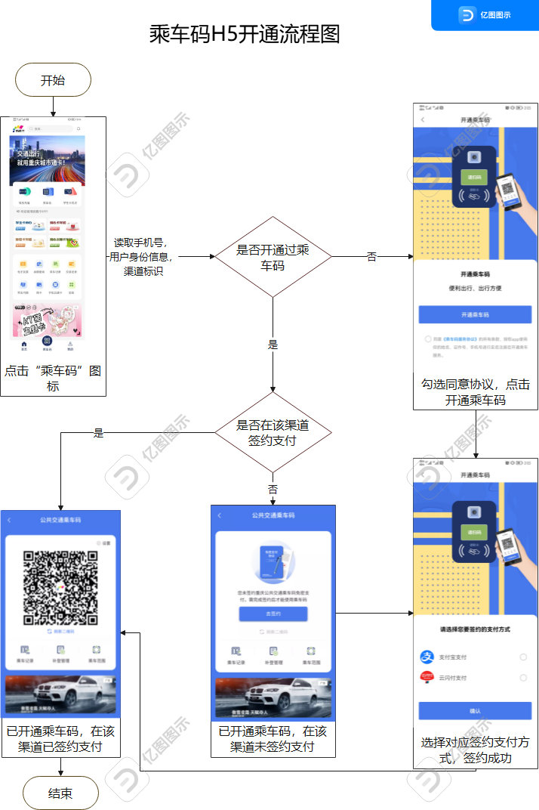
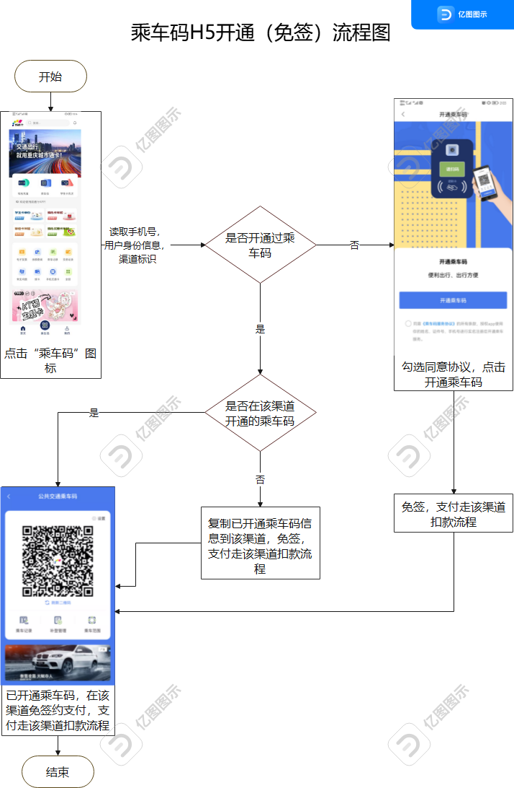

开发流程：





> [!info] 说明：
> - 同一个用户，分为APP渠道和第三方接入渠道，两个不能复用乘车码
> - APP/H5新用户都需要通过：开通乘车码——签约（免签除外）——展码的流程
> - APP/H5老用户如果有一方以及开通了乘车码：
> 	- 如果APP开通了乘车码
> 		- 非免签：在home显示“未签约”——签约——展码
> 		- 免签：直接展码
> 	- 如果H5开通了乘车码（同上）


## 乘车码开通

- [ ] 用户点击第三方 app 乘车码入口
- [ ] 第三方 APP 提交用户注册手机号到【重庆渝通行平台】，查询该用户是否已开通乘车码业务
- [ ] 未开通
  - [ ] H5 页面跳转到开通页，点击开通，调用接口。开通成功后提示用户账号注册成功，跳转到签约界面
  - [ ] 点击签约，调用接口，完成签约。提示用户【乘车码】业务开通成功。跳转到展码页面
- [ ] 已开通
  - [ ] 跳转到展码页面

## 乘车码展码消费

- [ ] 正常情况：
  - [ ] 二维码展示（后端获取），用户将二维码贴近公交机具或轨道闸机即可完成刷卡消费
  - [ ] 可以手动刷新展码，也可以自动刷新展码。

- [ ] 异常情况：
  - [ ] 支付解约或者未签约不展码，点击去签约弹签约方式选择
  - [ ] 存在待补登订单弹框提示，点击去补登跳转补登页面进行补登操作。
  - [ ] 待补登订单达到阈值后不展码，点击去补登跳转待补登管理页面
  - [ ] 存在未支付订单不进行展码

## 乘车记录

- [x] 缺省页
- [ ] 列表：默认展示当月的乘车记录，可以切换乘车类型展示，可以选择月份进行查询。（分为已扣款，待补登，）
- [ ] 详情页

## 补登管理

- [ ] 缺省页
- [ ] 列表页（同乘车列表
- [ ] 补登输入页
- [ ] 站点选择弹框

## 乘车范围

- [x] 一张图+文字（==来自后端？是的==

需要封装的组件：

- [ ] xxx

---

```thinking
让我仔细分析下这几个API请求方法的区别...

首先看看每个方法的基本特征:

portAPINo - 普通不加密请求
- encrypt: '00' 表示不加密
- 用于一般的API调用
- 使用 api/agent/ApiService/cardEntrance 接口

portAPI - 加密加签请求
- encrypt: '01' 表示使用SM4加密
- bodyInfo会进行加密处理
- 同样使用 api/agent/ApiService/cardEntrance 接口
- 更安全的API调用方式

portAPISpecial - 特殊请求(主要用于图片上传)
- 使用 api/agent/service/cardEntranceSpecial 接口
- 没有加密处理
- 专门用于处理图片等特殊内容

portQRAPINo - 乘车码不加密请求
- encrypt: '00' 不加密
- 使用 api/agent/SdkApiService/sdkEntrance 接口
- 专门用于乘车码相关功能
- 有特殊的header参数配置

portQRAPIH5No - H5乘车码不加密请求
- encrypt: '00' 不加密
- 使用 api/agent/H5ApiService/H5Entrance 接口
- 针对H5场景的乘车码功能
- 包含用户信息加密

portQRAPI - 乘车码加密请求
- encrypt: '01' 使用SM4加密
- 使用 api/agent/H5ApiService/H5Entrance 接口
- 加密版本的乘车码请求
- 完整的加密和签名流程

让我总结下主要区别...
```

这几个请求方法的主要区别如下：

1. 加密方式区别：

- 不加密组：portAPINo、portAPISpecial、portQRAPINo、portQRAPIH5No
- 加密组：portAPI、portQRAPI（使用 SM4 加密）

2. 使用场景区别：

- 普通 API 请求：portAPINo、portAPI
- 图片上传：portAPISpecial
- 乘车码功能：portQRAPINo、portQRAPIH5No、portQRAPI

3. 接口地址区别：

- cardEntrance：portAPINo、portAPI
- cardEntranceSpecial：portAPISpecial
- sdkEntrance：portQRAPINo
- H5Entrance：portQRAPIH5No、portQRAPI

4. 特殊功能：

- portAPISpecial：专门处理图片上传
- portQRAPIH5No：针对 H5 场景,包含用户信息加密
- portQRAPI：完整的乘车码加密请求流程

总的来说,这些方法根据不同的使用场景(普通 API、图片上传、乘车码)和安全需求(是否加密)进行了细分,以满足不同的业务需求。

传参：

- [ ] 哪些要传递？
- [ ] 哪些要使用后端返回的值？

```js
const userInfoObj = {
  idCardNum: data.idCardNum,
  name: data.name,
  userPhone: data.userPhone,
};

let datas = {
  headerInfo: {
    ...headerInfo,
    encrypt: isEncrypt ? '01' : '00', //指明请求和响应报文体是否加密  00：未加密；  01：SM4加密; 02: 3des加密;
    icftype: data.icftype || 0, //命令字类型
    syssesq: syssesq,
    ...(isQR
      ? {
          appId: userInfo.appId || '9993',
          userId: 'e86af557f9364aaa9dee2a216f483c78',
          deviceId: isSign ? data.deviceId : undefined,
          chanId: userInfo.merchantNo || '1000000500000000',
        }
      : {}),
  },
  bodyInfo: {
    identifyId: '123122',
    syssesq: syssesq,
    merchantNo: userInfo.merchantNo || '1000000500000000', //商户号
    terminalNo: userInfo.terminalNo || '', //terminalNo 终端编号
    travelUserId: isEncrypt ? undefined : localStorage.getItem('userId') || '',
    deviceInfo: {
      deviceId: localStorage.getItem('deviceId') || '2022071350056666', // 设备编号    未登录：设备唯一编号
      appVersionName: localStorage.getItem('appVersion') || localStorage.getItem('version'),
      deviceType: '0001' || '', //设备类型
      sign: userInfo.sign || 'qrcode', //签名
      packet: userInfo.packet || 'qrcode.h5', //包名
      appVersion: localStorage.getItem('appVersion') || localStorage.getItem('version'),
    },
    ...(isSign
      ? {
          userInfo: '04' + qrSM2.doEncrypt(JSON.stringify(userInfoObj), publicKey),
        }
      : {}),
    ...data,
  },
  signValue: 'signValue',
};
```
