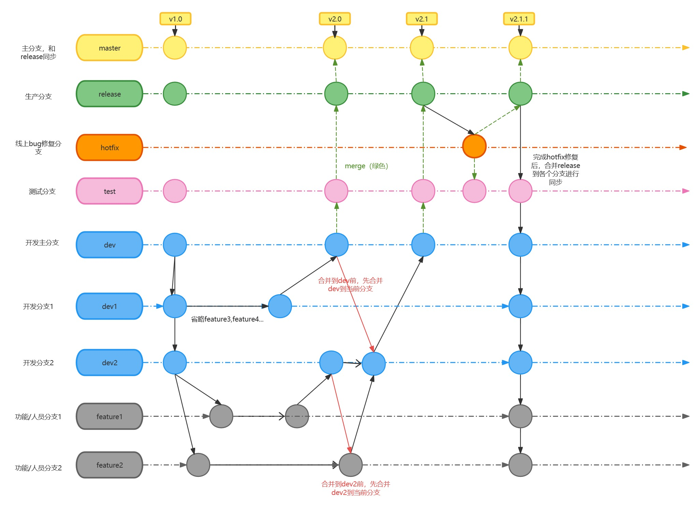

---
tags:
  - git
---

## 分支规范

1. 分支说明：
    1. 生产环境：master
    2. 测试环境：release
    3. 开发环境：dev
2. 命名规则：
    1. 功能开发：feature-功能描述-时间。如：feature-customer-20210723
    2. 线上bug修复：hotfix-tapdId-时间。如：hotfix-id10086-20210723
3. 流程说明：
    1. 需求开发：从**master**上切出新的feature分支，命名规则如上。
        1. 开发阶段：开发过程中可**自行**将feature分支合并到dev分支上进行调试验证。（tips：合并推送到远程仓库后，jenkins会自动打包构建，大约2-3分钟即可生效）
            
            ```bash
            git checkout dev
            git pull
            git merge feature-xx-xx-xx
            git push origin dev
            ```
            
        2. 测试阶段：完成自测后，在gitee上提交feature分支合并到release的PR，由需求owner或者组长进行代码审核后合并发布；
        3. 上线阶段：测试通过后，在gitee上提交feature分支合并到master的PR，由需求owner或者组长进行代码审核后合并发布；
    2. 缺陷修复：
        
        i. 针对测试阶段提出的bug，可在原有的feature分支上修复，在dev自测后提交合到release的PR;
        
        ii. 针对线上环境提出的bug，需从master上切除hotfix分支，命名规则如上。修复后首先在dev环境自测通过，通过后提交hotfix分支合并到release的PR，测试验证通过后提交hotfix分支合并到master的PR；
        

---

**自己花了半天整理的git多分支流程：**



[git分支版本管理| ProcessOn免费在线作图,在线流程图,在线思维导图](https://www.processon.com/view/link/663d9424a68d4076eaaaece6?cid=663d7c8436a45321ba8179b1)


参考git流程：


## SVN操作流程（单人开发）

- 开发新需求A，从master拉新分支到branches（假如为分支A）

```jsx
svn copy [源路径] [目标路径] -m "[提交消息]"

svn copy https://10.8.22.167:8443/svn/20240118-JSYDCL/Code/Trunk/yhtx/yhtx-vue https://10.8.22.167:8443/svn/20240118-JSYDCL/Code/Branches/yhtx/yhtx-vue -m "Creating a new branch from trunk"
```


- 切换到新分支A

```jsx
svn update  // 在切换之前，最好确保你的工作副本是最新的，以避免潜在的冲突。

svn switch [新分支的完整URL]
```


- 此时新分支A未开发完，并行开发新功能B，则从master拉新分支B，进行B功能的开发
- 当功能A开发完结后，需要合并到master
    - 先切换到master分支
    - 然后点击“合并按钮”


可以先测试，ok的话，直接合并。

合并后内容会在本地，需要commit，update才会到远程。

## 发布流程

### 需求

1. master切分支，命名`feature-customer-20210723`
2. 开发完成，merge到dev环境自测
3. 自测完成，提交PR到release环境
4. PR合并后，修改TAPD状态为`release发布`
5. 通知测试人员已经发布到测试环境

### Bug

1. master切分支，命名`hotfix-id10086-20210723`
2. 开发完成，merge到dev环境自测
3. 自测完成，提交PR到release环境
4. PR合并后，修改TAPD状态为`TEST验证`
    1. （如果是前端bug，还需要在评论中填写 缺陷单填写规范与处理时效）
5. 通知测试人员已经发布到测试环境

### 测试分支对应企业

给大家同步下关于现在测试环境代码发布的问题，首先接受一个概念，特性环境，其中测试环境

里有三种，：

- **周二发布环境， （周二发布环境对应的企业是：无锡晓程旭信息）**
- **周四发布环境， （周四发布环境对应的企业是：无锡天普网络）**
- **hotfix环境(通常用来验证紧急修复的bug) （hotfix环境对应的企业是：微盛网络科技有限公司）**

生产环境有2种

- **灰度环境**
- **正式环境**

正常流程：

比如：

- 如果你的bug或者需求是要求在2022-01-11上线， 则需要提PR到release-2分支， 然后去无锡晓程旭信息验证；
- 如果你的bug或者需求是要求在2022-01-13上线， 则需要提PR到release-4分支， 然后去无锡天普网络验证。
- 如果是紧急bug则提PR到release-bugfix分支， 微盛网络科技有限公司

上述的流程需要和后端保持一致；

如果你的bug不依赖后端接口， 单纯的只是前端bug， 即可根据你需要在哪个企业验证来提对应分支的PR：

- 无锡晓程旭 -- release-2
- 无锡天普 -- release-4
- 微盛网络科技有限公司 -- release-bugfix
- master特性分支-- release

**2022-03-28**

标品同学注意下，现在特性环境分支的合并规则有了改变，

- 保留release，release-bugfix
- ~~废弃掉release-2，release-4分支~~
- 新增release-xx（特性环境标识，如：release-v20220331）

后面可能存在多个特性环境分支。

举个例子：

- 需求：本周四也就是20220331是上线日，那么会新增特性环境v20220331，对应的前端，后端会新建release-v20220331分支，那么在本周四上线的需求就往release-v20220331上提PR。
- bug：
    - 不涉及到后端改动的，则可以往release或者release-bugfix上提PR，在无特性环境或者特性环境是hotfix的企业中验证。
    - 涉及到后端改动的，则看后端是发在哪个特性环境分支中，对应的前端就往哪个特性环境分支上提PR，如果前端没有分支的可找我创建。

## 注意事项

1. **切记**不可将远程或者本地的dev，release分支合并到自己的feature，hotfix 分支；
2. 提交的PR存在冲突时，**切记不要使用web端的工具自行解决冲突（会导致反向操作，比如：pr是A合到B, 该方式会B合到A，所以不要采用WebIDE来解决冲突）**，联系@居易@阿遥@无迪处理；
3. 代码合并冲突时需要联系冲突方解决冲突。解决后需双方验证。如因未验证导致线上问题，问题归属冲突解决方;
4. **定期将master分支合并到自己的feature分支；**
5. 计划每周一重置dev，release分支，保持和master同步；
6. 配置git用户名为公司花名，邮箱为公司邮箱。示例如下：

```bash
git config --global user.name "居易"
git config --global user.email "juyi@wshoto.com"
```