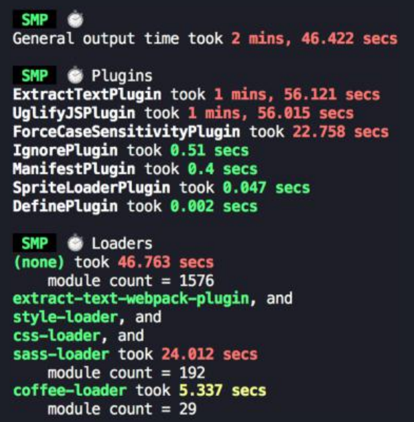
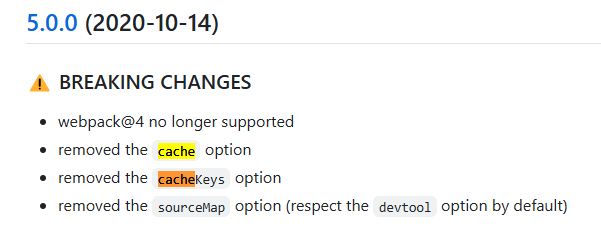

## 打包速度优化

### 分析工具

`speed-measure-webpack-plugin` 是一个 Webpack 插件，主要功能是对 Webpack 的各个插件和loader进行时间测量，并以可视化的方式展示这些信息。这样开发者可以很容易地发现哪些步骤耗时较多，从而进行针对性的优化。

安装：

```
npm install speed-measure-webpack-plugin -D
```

配置：

```js
const SpeedMeasurePlugin = require("speed-measure-webpack-plugin");
const smp = new SpeedMeasurePlugin();

const webpackConfig = {
  // 你的 Webpack 配置
  // ...
};

module.exports = smp.wrap(webpackConfig);
```



::: tip
通过分析，找到速度瓶颈，比如是某个 loader 或者 plugin，然后就可以通过 chatgpt 或者 google 查找关于这个 loader，plugin 的速度优化建议。
:::

### 通用速度优化

当 webpack 打包的时候，会自动启用比如代码压缩、作用域提升和树摇（tree shaking）等，除此之外，还有一些优化需要我们自己配置：

#### 1、使用高版本的 webpack 和 Node.js

新版本的内容都会有比较大的性能提升，对于打包速度提升比较明显，能升级进来升级。

比如从 webpack3 升级到 webpack4，nodejs 从 12 升级到 16.

但是也要注意兼容性问题。


#### 2、并行构建

`thread-loader` 是 Webpack 的一个加载器，用于在 Webpack 构建过程中启用多线程，以加快构建速度。`thread-loader` 将某些繁重的任务分发到多个 worker 线程中进行处理，从而利用多核 CPU 的优势提高构建性能。

安装：

```
npm i thread-loader -D
```

配置：以下是一个完整的 Webpack 4 配置示例，展示了如何使用 `thread-loader` 并行处理 `babel-loader` 和 `css-loader`：

```js
const path = require("path");

const numWorkers = os.cpus().length - 1; // 获取 CPU 核心数并减一

module.exports = {
  entry: "./src/index.js",
  output: {
    filename: "bundle.js",
    path: path.resolve(__dirname, "dist"),
  },
  module: {
    rules: [
      {
        test: /\.js$/,
        exclude: /node_modules/,
        use: [
          {
            loader: "thread-loader",
            options: {
              workers: numWorkers, // 开启的 worker 线程数
              workerParallelJobs: 50, // 每个 worker 线程并行处理的作业数
              poolTimeout: 2000, // 闲置时，保持 worker 线程存活的时间（单位：ms）
            },
          },
          "babel-loader",
        ],
      },
    ],
  },
  plugins: [
    // 其他插件
  ],
};
```

> ❗️ 注意：`thread-loader` 需要添加到其他 loader 最前面。

#### 3、并行压缩

`terser-webpack-plugin` 是 Webpack 中用于压缩 JavaScript 文件的插件。它默认支持并行压缩，可以利用多核 CPU 提高构建速度。

安装：

```
npm install terser-webpack-plugin -D
```

配置：

```js
const TerserPlugin = require("terser-webpack-plugin");
const path = require("path");

module.exports = {
  //...
  optimization: {
    minimize: true, // 启用压缩
    minimizer: [
      new TerserPlugin({
        parallel: true, // 启用并行压缩
        terserOptions: {
          compress: {
            drop_console: true, // 移除 console 语句
            drop_debugger: true, // 移除 debugger 语句
            // 其他压缩选项
          },
          output: {
            comments: false, // 移除注释
          },
        },
      }),
    ],
  },
  //...
};
```

#### 4、开启构建缓存

缓存思路：

- **babel-loader 开启缓存**：`babel-loader` 是用来将 ES6+ 代码转译为 ES5 的工具。在大项目中，转译 JavaScript 文件是一个耗时的过程。启用缓存后，`babel-loader` 会将转译后的结果存储起来，当相同的文件再次被处理时，可以直接使用缓存结果，而不需要重新转译。
- **terser-webpack-plugin 开启缓存**：`terser-webpack-plugin` 是用来压缩 JavaScript 文件的插件。压缩过程同样是一个耗时的操作，特别是对大型项目。启用缓存后，`terser-webpack-plugin` 会将压缩后的结果存储起来，以便在相同的文件再次被处理时，直接使用缓存结果。
- **使用 hard-source-webpack-plugin**：`hard-source-webpack-plugin` 为 Webpack 提供了模块级别的缓存。它会将模块编译后的结果存储到磁盘上，在下一次构建时直接读取缓存结果，而不需要重新编译。

安装：

```
npm install cache-loader terser-webpack-plugin hard-source-webpack-plugin -D
```

配置：
1、使用 `cache-loader` 作为 `babel-loader` 的前置加载器，并指定缓存目录。

```js
{
  test: /\.js$/,
  exclude: /node_modules/,
  use: [
    {
      loader: 'cache-loader',
      options: {
        cacheDirectory: path.resolve(__dirname, '.cache/babel-loader'),
      },
    },
    'babel-loader'
  ]
}

```

2、开启压缩缓存，在 `terser-webpack-plugin` 配置中启用 `cache` 选项，并设置缓存键（可选）

```js
const TerserPlugin = require('terser-webpack-plugin');

//...

optimization: {
  minimize: true, // 启用压缩
  minimizer: [
    new TerserPlugin({
      parallel: true, // 启用并行压缩
      cache: true, // 启用缓存
      cacheKeys: (defaultCacheKeys, file) => {
        // 自定义缓存键（可选）
        return {
          ...defaultCacheKeys,
          myCustomCacheKey: 'myCustomCacheKeyValue',
        };
      },
      terserOptions: {
        compress: {
          drop_console: true, // 移除 console 语句
        },
      },
    }),
  ],
}

```

注意：在terser-webpack-plugin v5版本中，移除了`cache`和`cacheKeys`选项：


因为在webpack5中，会有单独的[cache](https://webpack.docschina.org/configuration/cache/#cache)选项去配置。

> Webpack has built-in cache [https://webpack.js.org/configuration/cache/#cachetype](https://webpack.js.org/configuration/cache/#cachetype), if you set `type: 'filesystem',`, you will cache not only terser output, but all webpack build (try it and the next build will be faster), note - when you use `filesystem` memory cache will be used too.


3、在 Webpack 配置中的 `plugins` 数组中添加 `HardSourceWebpackPlugin` 插件

```js
const HardSourceWebpackPlugin = require("hard-source-webpack-plugin");

//...

plugins: [new HardSourceWebpackPlugin()];
```

## 体积优化

### 分析工具

`webpack-bundle-analyzer` 是一个 Webpack 插件和 CLI 工具，生成一个交互式的树图（treemap），显示项目的各个模块及其大小。用于可视化分析 Webpack 输出文件的体积构成。通过这个插件，你可以清晰地看到项目中每个依赖包和文件所占用的空间，从而优化和减少打包文件的体积。

安装：

```
npm install webpack-bundle-analyzer -D
```

配置：

```js
const { BundleAnalyzerPlugin } = require("webpack-bundle-analyzer");

module.exports = {
  // 你的 Webpack 配置
  plugins: [new BundleAnalyzerPlugin()],
};
```

构建完成后，`webpack-bundle-analyzer` 会自动在浏览器中打开一个服务器，展示打包文件的详细分析报告。

::: tip
通过分析，找到速度瓶颈，比如是 ElemetUI 包比较大，然后就可以通过 chatgpt 或者 google 查找关于这个包体积大小优化建议。
:::

### 通用打包体积优化

#### 1、css tree shaking

使用 `purgecss-webpack-plugin` 移除未使用的 CSS。

安装：

```
npm install purgecss-webpack-plugin glob -D
```

配置：

```js
const { PurgecssPlugin } = require("purgecss-webpack-plugin");
const glob = require("glob");
const path = require("path");

module.exports = {
  plugins: [
    new PurgecssPlugin({
      paths: glob.sync(`${path.join(__dirname, "src")}/**/*`, { nodir: true }),
    }),
  ],
};
```

#### 2、启用 Gzip 压缩

使用 compression-webpack-plugin 启用 Gzip 压缩

安装：

```
npm install --save-dev compression-webpack-plugin
```

配置：

```js
const CompressionPlugin = require("compression-webpack-plugin");

module.exports = {
  plugins: [
    new CompressionPlugin({
      test: /\.js(\?.*)?$/i,
    }),
  ],
};
```

#### 3、图片压缩

使用 `image-webpack-loader` 对图片进行优化，减少图片文件的大小。

安装：

```
npm install --save-dev image-webpack-loader
```

配置：

```js
module.exports = {
  module: {
    rules: [
      {
        test: /\.(png|jpe?g|gif|svg)$/i,
        use: [
          {
            loader: "file-loader",
          },
          {
            loader: "image-webpack-loader",
            options: {
              mozjpeg: {
                progressive: true,
              },
              optipng: {
                enabled: false,
              },
              pngquant: {
                quality: [0.65, 0.9],
                speed: 4,
              },
              gifsicle: {
                interlaced: false,
              },
              webp: {
                quality: 75,
              },
            },
          },
        ],
      },
    ],
  },
};
```

#### 4、动态 polyfill

> 一般不需要，我们通过在 package.json 中的 browserslist 限制目标浏览器。

`babel-preset-env` 是一个智能预设，可以根据目标环境（浏览器或 Node.js）的不同，仅编译需要的语法特性，并引入必要的 polyfills，从而减少最终构建的代码体积，提高运行效率。

安装：

```
npm install --save-dev @babel/preset-env core-js
```

新增`.babelrc` 文件：

```json
{
  "presets": [
    [
      "@babel/preset-env",
      {
        "useBuiltIns": "usage", // 使用 'usage' 方式按需引入 polyfills
        "corejs": 3, // 使用 core-js 版本 3
        "targets": {
          "browsers": ["> 1%", "last 2 versions", "not dead"] // 目标环境
        }
      }
    ]
  ]
}
```

webpack 配置文件不需要额外的配置。
