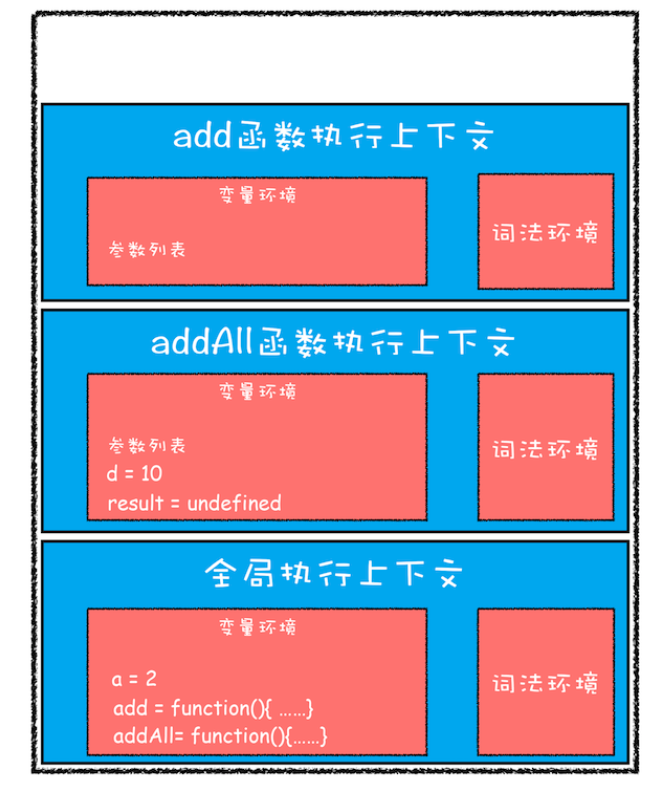
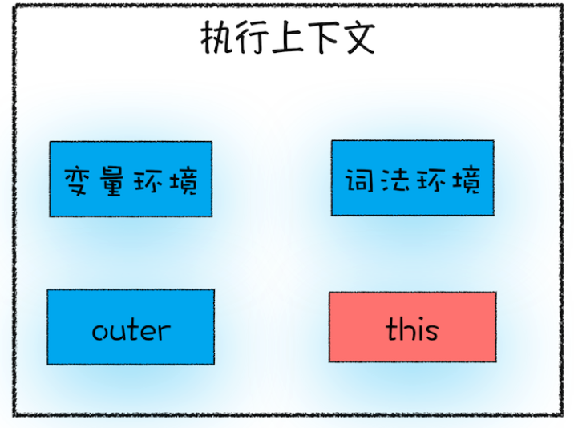

## 执行上下文

理解了底层（执行上下文），上层的[变量提升](https://daotin.github.io/posts/2019/05/16/js%E5%8F%98%E9%87%8F%E6%8F%90%E5%8D%87%E4%B8%8E%E5%87%BD%E6%95%B0%E6%8F%90%E5%8D%87%E7%9A%84%E8%AF%A6%E7%BB%86%E8%BF%87%E7%A8%8B.html)，作用域，闭包就理解了。

但，实际上，变量定义的位置并没有改变，而是因为经过了编译过程。

编译的时候，会把这些提升放到一个叫「变量环境」的地方。剩下的部分放在「可执行代码」部分。

执行代码的时候，缺什么就到变量环境去找。

主要是理解 js 代码是「**先编译，再执行**」的。


执行上下文的范围分 3 种：

- 全局执行上下文
- 函数体执行上下文
- eval 执行上下文

## 调用栈

> 调用栈就是用来管理函数调用关系的一种数据结构。

当有多个执行上下文的时候，通过栈（后进先出）的结构，进行管理和调用。

类似下面这样的结构，当函数执行完后，就会从栈顶弹出：

```js
var a = 2;
function add(b, c) {
  return b + c;
}
function addAll(b, c) {
  var d = 10;
  result = add(b, c);
  return a + result + d;
}
addAll(3, 6);
```



## 块级作用域

由于变量提升，导致很多意料之外的结果，所以引入了 let 和 const，也就有了块级作用域。

那么，let/const 是如何影响执行上下文的？

```js
function foo() {
  var a = 1;
  let b = 2;
  {
    let b = 3;
    var c = 4;
    let d = 5;
    console.log(a);
    console.log(b);
  }
  console.log(b);
  console.log(c);
  console.log(d);
}
foo();
```

a,c 会被提取到「变量环境」，但是 let 定义的变量不会，而是放到之前一直没提到的「词法环境」

> 并且，let 和 const 定义的变量，不会变量提升。

而且，当执行到 let b = 3 的时候，作用域块中通过 let 声明的变量，会被存放在词法环境的一个单独的区域中。


其实，在词法环境内部，维护了一个小型栈结构，栈底是函数最外层的变量，进入一个作用域块后，就会把该作用域块内部的变量压到栈顶；当作用域执行完成之后，该作用域的信息就会从栈顶弹出，这就是词法环境的结构。需要注意下，我这里所讲的变量是指通过 let 或者 const 声明的变量。

执行代码的时候，变量的查找，就从:沿着词法环境的栈顶向下查询，如果在词法环境中的某个块中查找到了，就直接返回给 JavaScript 引擎，如果没有查找到，那么继续在变量环境中查找。


因此，块级作用域就是通过词法环境的栈结构来实现的，而变量提升是通过变量环境来实现，通过这两者的结合，JavaScript 引擎也就同时**支持了变量提升和块级作用域**了。

:::warning
注意，let 和 const 会被变量提升，但是不会被初始化为`undefined`，而是初始化为`uninitailized`，当访问 uninitailized 的变量的时候，就会报错：ReferenceError: Cannot access 'xxx' before initialization
:::

举例：

```js
let myname = '极客时间';
{
  console.log(myname); // referenceError: Cannot access 'myname' before initialization
  let myname = '极客邦';
}
```

如果说 let 和 const 不存在变量提升，那么按照从词法环境到变量环境的查询顺序，最后打印的会是“极客时间”，但是结果不是，所以显然是有提升的，

但是，如果提升为 undefined，那么按照从词法环境到变量环境的查询顺序，打印的是 undefined，但是实际上报错，所以，其实会变量提升，只不是不是初始化为 undefined，而是 uninitailized，当访问 uninitailized 的变量的时候，就会报错，这样就解释得通了。

## 作用域链

下面代码打印什么？是按照调用栈的顺序来查找变量的吗？然后打印“极客邦”？

```js
function bar() {
  console.log(myName);
}
function foo() {
  var myName = '极客邦';
  bar();
}
var myName = '极客时间';
foo();
```


非也。打印的是“极客时间”。why？这就涉及到作用域链了。

其实，在每个执行上下文的变量环境中，都包含了一个外部引用，用来指向外部的执行上下文，我们把这个外部引用称为 outer。

比如上面那段代码在查找 myName 变量时，如果在当前的变量环境中没有查找到，那么 JavaScript 引擎会继续在 outer 所指向的执行上下文中查找。


可以看到是指向全局执行上下文的，为什么呢？

这里就涉及到词法作用域了，作用域链是由`词法作用域`决定的。

### 词法作用域

词法作用域就是指：作用域是由代码中**函数声明的位置**来决定的，所以词法作用域是静态的作用域，通过它就能够预测代码在执行过程中如何查找标识符。

静态的意思是：词法作用域是代码编译阶段就决定好的，和函数是怎么调用的没有关系。

> 上面是全局作用域和函数级作用域来分析了作用域链，那块级作用域中变量是如何查找的？

示例：

```js
function bar() {
  var myName = '极客世界';
  let test1 = 100;
  if (1) {
    let myName = 'Chrome浏览器';
    console.log(test);
  }
}
function foo() {
  var myName = '极客邦';
  let test = 2;
  {
    let test = 3;
    bar();
  }
}
var myName = '极客时间';
let myAge = 10;
let test = 1;
foo();
```

查找顺序如下：


按照 1,2,3,4,5 的顺序进行查找，最后打印的结果不是 3，而是 1。

:::tip ❓ 有点迷糊了，调用栈和作用域链有什么区别和联系？

1. 调用栈主要用于跟踪程序的执行顺序,而作用域链用于确定变量的访问权限。
2. 调用栈是一个动态的过程,随着函数的调用和返回而变化。而作用域链在函数定义时就已经确定,不会随函数调用而改变。
3. 它们之间的主要联系体现在执行上下文中。每次函数调用都会创建一个新的执行上下文,包含了当前的调用栈信息和该函数的作用域链。
4. 在变量查找过程中,JavaScript 引擎首先在当前执行上下文(调用栈顶部)中查找变量,如果找不到,则沿着作用域链继续查找。

:::

### 闭包

定义：在 JavaScript 中，根据**词法作用域**的规则，内部函数总是可以访问其外部函数中声明的变量，当通过调用一个外部函数返回一个内部函数后，即使该外部函数已经执行结束了，但是内部函数引用外部函数的变量依然保存在内存中，我们就把这些变量的集合称为闭包。比如外部函数是 foo，那么这些变量的集合就称为 foo 函数的闭包。

闭包危害：

- 如果引用闭包的函数是一个全局变量，那么闭包会一直存在直到页面关闭；但如果这个闭包以后不再使用的话，就会造成内存泄漏。
- 如果引用闭包的函数是个局部变量，等函数销毁后，在下次 JavaScript 引擎执行垃圾回收时，就会回收这块内存。

#### 闭包的应用场景

闭包在实际开发中有广泛的应用，主要用于以下几种场景：

1. **数据封装和模块化**

闭包可以用来创建私有变量和方法，从而实现数据的封装。在 JavaScript 中，没有传统意义上的私有属性，通过闭包可以模拟私有属性。

比如经典的**防抖节流**代码：https://daotin.github.io/posts/2020/01/07/%E9%98%B2%E6%8A%96vs%E8%8A%82%E6%B5%81.html

2. **for 循环正确打印 i 值**

在以下代码中，由于 var 声明的变量是函数作用域，所有的异步操作共享同一个 i，最终会打印同一个值（循环结束后的值）：

```js
for (var i = 0; i < 5; i++) {
  setTimeout(function () {
    console.log(i); // 5, 5, 5, 5, 5
  }, 1000);
}
```

但是，我们可以使用闭包的特性，使用一个自执行函数（IIFE）创建一个闭包，确保每次循环的 i 值独立：

```js
for (var i = 0; i < 5; i++) {
  (function (i) {
    setTimeout(function () {
      console.log(i); // 0, 1, 2, 3, 4
    }, 1000);
  })(i);
}
```

> 一个函数返回另一个函数才是闭包，为什么 IIFE 这种是闭包？

严格来说，闭包是指一个函数返回另一个函数，并且这个返回的函数可以访问外部函数的变量。而在案例中，虽然没有显式地返回函数，但它使用了 IIFE，这仍然满足闭包的定义：**在函数内部创建了一个可访问外部变量 i 的函数**。

在案例中，`(function(i) { ... })(i)` 就是创建了一个闭包，每次循环都会创建一个新的闭包，传递当前的 i 值给它。而 setTimeout 内的匿名函数是访问 i 的内部函数，外部函数执行完了，但是 setTimeout 里面的内部函数，依然可以访问 i，这就是闭包。

3. **函数柯里化**

函数柯里化是一种将多参数函数转换为一系列单参数函数的技术。闭包在实现函数柯里化时非常有用。

```javascript
function multiply(a) {
  return function (b) {
    return a * b;
  };
}

const double = multiply(2);
console.log(double(5)); // 10
console.log(multiply(3)(4)); // 12
```

在这个例子中，`multiply` 函数返回一个闭包，闭包记住了 `a` 的值，从而实现了函数柯里化。

> 如何利用闭包的柯里化，实现 sum(1)(2).value()、sum(1,2).value()都要输出 3？

```js
function sum(...args) {
  // 内部累加器函数
  const add = (...newArgs) => {
    // 累加新传入的参数
    args = args.concat(newArgs);
    // 返回add函数本身，实现链式调用
    return add;
  };

  // 给add函数附加value方法
  add.value = () => args.reduce((acc, curr) => acc + curr, 0);

  // 第一次调用sum时返回add函数
  return add(...args);
}

// 示例用法
console.log(sum(1)(2).value()); // 3
console.log(sum(1, 2).value()); // 3
console.log(sum(1)(2)(3).value()); // 6
console.log(sum(1, 2, 3).value()); // 6
```

## this

首先明确一点，作用域链和 this 是两套不同的系统，它们之间基本没太多联系。

this 其实也是执行上下文中的一部分，而且因为执行上下文分为 3 种，所以 this 也分为三种。全局执行上下文中的 this、函数中的 this 和 eval 中的 this。



- 全局执行上下文中的 this 是指向 window 对象
- 在默认情况下调用一个函数，其执行上下文中的 this 也是指向 window 对象
- 使用对象来调用其内部的一个方法，该方法的 this 是指向对象本身

下面这个代码打印什么？

```js
var a = 1;
var obj = {
  a: 2,
  getA: function () {
    return this.a;
  },
};
console.log(obj.getA());
```

> 为什么将普通函数改成箭头函数会导致 this 的值变成 1?

这是因为箭头函数和普通函数对`this`的处理方式不同：

1. 普通函数的`this`是动态的，取决于函数如何被调用。当通过`obj.getA()`调用时，`this`指向`obj`对象。
2. 箭头函数的`this`是词法作用域的，它继承自定义时所在的上下文。在全局作用域定义的箭头函数中，`this`指向全局对象（在严格模式下是`undefined`）。

> 为什么箭头函数的情况下，var a 改成 let a 时，this.a 就是 undefined？

因为箭头函数时， this 指向全局对象，但 let a 没有创建全局对象的属性。类似于：

```js
let b = 123;
console.log(this.b); // undefined
```

如何改变 this 的指向？使用函数的 call，apply，bind 属性。

## 总结

1、因为`执行上下文`的影响，js 会先编译，在执行，所以会有变量提升。

2、一段代码里面不止一个执行上下文，如何管理的？就是`调用栈`。

3、由于 js 的缺陷，没有`块级作用域`，所以引入 let，const，于是引入「`词法环境`」，于是在一个执行上下文的查找顺序是先查词法环境，再查变量环境。注意是一个执行上下文环境。

4、如果当前执行上下文找不到，就会沿着`作用域链`去找，怎么找？这就涉及到`outer`和`词法作用域`了。

5、在词法作用域的理念中，会有一个很特殊的东西，叫「`闭包`」的概念。

6、然而，当一个对象的属性是方法的时候，调用的该方法去访问属性 A，根据作用域链，访问的不是对象的属性 A，而是其他的执行上下文的 A，这就和常识违背了，因为在对象内部的方法中使用对象内部的属性是一个非常普遍的需求，于是就引入了`this`的概念和作用域链是两个完全无关的东西。虽然可以通过`对象名.A`的方式使用，但是增加代码的冗余性和可维护性。
