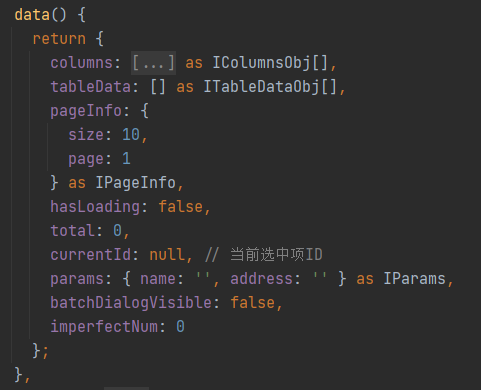
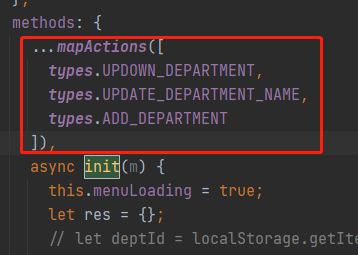
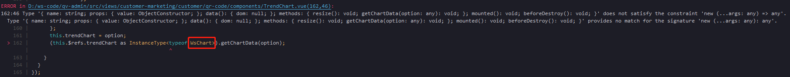

# TypeScript 笔记

> 💡 专业能力要求：
>
> P5/P4: 常见简单的会用，能遵守上述规范，常见系统内置类型会用, 如｜ & ？ typeof, Pick<>
>
> P6: 泛型、递归类型、索引类型、系统内置类型会灵活使用
>
> P7: 系统内置类型能实现， 包括但不限于 extends/infer/ThisType<>/InstanceOf/Exclude； 能实现开源类库 d.ts 同等难度。

在线 Demo：[ 演练场 - 一个用于 TypeScript 和 JavaScript 的在线编辑器](https://www.typescriptlang.org/zh/play)

## TypeScript 数据类型

### TypeScript 是静态类型

类型系统按照「类型检查的时机」来分类，可以分为动态类型和静态类型。

**动态类型是指在运行时才会进行类型检查**，这种语言的类型错误往往会导致运行时错误。JavaScript 是一门解释型语言，没有编译阶段，所以它是动态类型。

静态类型是指编译阶段就能确定每个变量的类型，这种语言的类型错误往往会导致语法错误。TypeScript 在运行前需要先编译为 JavaScript，而在编译阶段就会进行类型检查，所以 **TypeScript 是静态类型**

### TypeScript 是弱类型

类型系统按照「是否允许隐式类型转换」来分类，可以分为强类型和弱类型。

TypeScript 是完全兼容 JavaScript 的，它不会修改 JavaScript 运行时的特性，所以**它们都是弱类型**。

这样的类型系统体现了 TypeScript 的核心设计理念：**在完整保留 JavaScript 运行时行为的基础上，通过引入静态类型系统来提高代码的可维护性，减少可能出现的 bug。**

**TypeScript 只会在编译时对类型进行静态检查，如果发现有错误，编译的时候就会报错**。而在运行时，与普通的 JavaScript 文件一样，不会对类型进行检查。

**TypeScript 编译的时候即使报错了，还是会生成编译结果**，我们仍然可以使用这个编译之后的文件。

所以，**TypeScript 通过类型注解提供编译时的静态类型检查。**

可以通过配置`tsconfig.json`，在报错的时候终止 js 文件的生成，配置 `noEmitOnError` 即可。

可通过 tsc 命令来查看 ts 文件编译后的 js 文件

安装 typescript

```javascript
npm install -g typescript
```

执行 tsc 命令编译 ts 文件

```javascript
tsc filename.ts
```

## 原始数据类型

### 基本数据类型

```javascript
string;
boolean;
number;
bigint;
null;
undefined;
```

```javascript
let unusable: void = undefined;
let u: undefined = undefined;
let n: null = null;
```

与 `void` 的区别是，`undefined` 和 `null` 是所有类型的子类型。也就是说 `undefined` 类型的变量，可以赋值给 `number` 类型的变量，但是`void`类型的不可以：

```javascript
let num: number = undefined;
```

> PS：**以上只在**\*\*`"strict": true,`非严格模式下生效\*\*​

### enum

使用枚举我们可以定义一些带名字的常量。TypeScript 支持数字的和基于字符串的枚举。

**数字枚举**

```typescript
enum Direction {
  Up = 1,
  Down,
  Left,
  Right,
}
```

如上，我们定义了一个数字枚举， `Up`使用初始化为 `1`。 其余的成员会从 `1`开始自动增长。 换句话说， `Direction.Up`的值为 `1`， `Down`为 `2`， `Left`为 `3`， `Right`为 `4`。

我们还可以完全不使用初始化器：

```typescript
enum Color {
  red, // 默认为0
  green,
  blue,
}
```

**字符串枚举**

字符串枚举的概念很简单，但是有细微的 [运行时的差别](https://www.tslang.cn/docs/handbook/enums.html#enums-at-runtime '运行时的差别')。 在一个字符串枚举里，每个成员都必须用字符串字面量，或另外一个字符串枚举成员进行初始化。

```typescript
enum Direction {
  Up = 'UP',
  Down = 'DOWN',
  Left = 'LEFT',
  Right = 'RIGHT',
}
```

**const 常量枚举**

大多数情况下，枚举是十分有效的方案。 然而在某些情况下为了避免在额外生成的代码上的开销和额外的非直接的对枚举成员的访问，我们可以使用 `const`枚举。

一般的枚举。在运行执行时，它将会查找变量 `Color.Blue`

```typescript
enum Color {
  Red,
  Blue,
  Green,
}

let color = Color.Blue;

// 会被编译成

var Color;
(function (Color) {
  Color[(Color['Red'] = 0)] = 'Red';
  Color[(Color['Blue'] = 1)] = 'Blue';
  Color[(Color['Green'] = 2)] = 'Green';
})(Color || (Color = {}));
var color = Color.Blue;
```

如果是常量枚举，则会在编译阶段会被删除。 常量枚举成员在使用的地方会被内联进来。

```typescript
const enum Color {
  Red,
  Blue,
  Green,
}

let color = Color.Blue;

// 会被编译成

var color = 1; /* Blue */
```

### any

1、**声明一个变量为任意值之后，对它的任何操作，返回的内容的类型都是任意值**。

2、**变量如果在声明的时候，未指定其类型，那么它会被识别为任意值类型**

> **any 类型完全不被类型检查**

当你不想写出一个长的类型来说服 TypeScript 相信某一行代码是可行的时候，any 类型是有用的。

```typescript
let obj: any = { x: 0 };
// None of the following lines of code will throw compiler errors.
// Using `any` disables all further type checking, and it is assumed
// you know the environment better than TypeScript.
obj.foo();
obj();
obj.bar = 100;
obj = 'hello';
const n: number = obj;
```

### unknown

[https://juejin.cn/post/7024686544086630436](https://juejin.cn/post/7024686544086630436 'https://juejin.cn/post/7024686544086630436')

[https://juejin.cn/post/6844903866073350151](https://juejin.cn/post/6844903866073350151 'https://juejin.cn/post/6844903866073350151')

TypeScript 3.0 引入了新的`unknown` 类型，这与 any 类型类似，但更安全，因为对未知值做任何事情都是不合法的。

`unknown` 和 `any` 的主要区别是 `unknown` 类型会更加严格：在对 `unknown`类型的值执行大多数操作之前，我们必须进行某种形式的检查 **（意味着在我们已经知道内容类型）**。而在对`any` 类型的值执行操作之前，我们不必进行任何检查。

```typescript
function foo(a: unknown) {
  a.split(''); // Object is of type 'unknown'
}

function foo(a: unknown) {
  if (typeof a === 'string') {
    a.split('');
  }
}
```

### object

特殊类型的 object 指的是任何不是基元的值（字符串、数字、bigint、布尔值、符号、null 或未定义）。这与空对象类型{ }不同，也与全局类型 Object 不同。你很可能永远不会使用 Object。

object 类型的关注点在于类型的分类，它强调一个类型是非原始类型，即对象类型。

> `object` is not `Object`. **Always** use `object`!

Object 是 Object.prototype 的类型。

### never

- 一个从来不会有返回值的函数（如：如果函数内含有 `while(true) {}`）；
- 一个总是会抛出错误的函数（如：`function foo() { throw new Error('Not Implemented') }`，`foo` 的返回类型是 `never`）；

```typescript
function bar(): never {
  throw new Error('xxx');
}

function bar(): never {
  while (1) {}
}
```

- [https://jkchao.github.io/typescript-book-chinese/typings/neverType.html#用例：详细的检查](https://jkchao.github.io/typescript-book-chinese/typings/neverType.html#用例：详细的检查 'https://jkchao.github.io/typescript-book-chinese/typings/neverType.html#用例：详细的检查')

**与 \*\***`void`\***\* 的差异**

实际上，`void` 表示没有任何类型，`never` 表示永远不存在的值的类型。

当一个函数返回空值时，它的返回值为 void 类型，但是，当一个函数永不返回时（或者总是抛出错误），它的返回值为 never 类型。void 类型可以被赋值（在 strictNullChecking 为 false 时），但是除了 never 本身以外，其他任何类型不能赋值给 never。

### 联合类型

```javascript
let something: string | number;
```

访问联合类型的属性或方法：**只能访问此联合类型的所有类型里共有的属性或方法**：

```javascript
function getString(something: string | number): string {
  return something.toString();
}
```

否则会报错：

```typescript
function printId(id: number | string) {
  console.log(id.toUpperCase());
  // Property 'toUpperCase' does not exist on type 'string | number'.
  //Property 'toUpperCase' does not exist on type 'number'.
}
```

解决方案是用代码缩小联合，就像你在没有类型注释的 JavaScript 中一样。当 TypeScript 可以根据代码的结构为一个值推断出一个更具体的类型时，就会发生缩小。

```typescript
function printId(id: number | string) {
  if (typeof id === 'string') {
    // In this branch, id is of type 'string'
    console.log(id.toUpperCase());
  } else {
    // Here, id is of type 'number'
    console.log(id);
  }
}
```

联合类型的一个流行的用例是描述一个值所允许的字符串或数字字面的集合。

```typescript
type WindowStates = 'open' | 'closed' | 'minimized';
type LockStates = 'locked' | 'unlocked';
type PositiveOddNumbersUnderTen = 1 | 3 | 5 | 7 | 9;
```

## 对象类型

### 接口 interface

匿名的方式：

```typescript
function greet(person: { name: string; age: number }) {
  return 'Hello ' + person.name;
}
```

或者可以通过使用接口的方式：

```javascript
interface Person {
  name: string;
  age: number;
}

function greet(person: Person) {
  return 'Hello ' + person.name;
}
```

**赋值的时候，变量的形状必须和接口的形状保持一致**,少了一些属性，多一些属性都是不允许的。

```javascript
let tom: Person = {
  name: 'Tom',
  age: 25,
};
```

### **可选属性** ?:

```javascript
interface Person {
  name: string;
  age?: number;
}
```

### **任意属性**（索引签名）

有时你不能提前知道一个类型的所有属性名称，但你知道这些值的形状。

**一旦定义了任意属性，那么确定属性和可选属性的类型都必须是它的类型的子集**：

```javascript
interface Person {
  name: string;
  age?: number; // age不是string类型会报错
  [x: string]: string;
}

let tom: Person = {
  name: 'Tom',
  age: 25,
  gender: 'male',
};
```

一个接口中只能定义一个任意属性。如果接口中有多个类型的属性，则可以在任意属性中使用联合类型：

```javascript
interface Person {
  name: string;
  age?: number;
  [x: string]: string | number;
}

let tom: Person = {
  name: 'Tom',
  age: 25,
  gender: 'male',
};
```

\*\*在该语法中， x 表示索引名， 它可以为任意合法的标识符。索引名只起到占位的作用， 它不代表真实的对象属性名； \*\*

在字符串索引签名中， 索引名的类型必须为 string 或者 number 类型；

### **只读属性**readonly

只能在创建的时候被赋值。

虽然它不会在运行时改变任何行为，但在类型检查期间，标记为只读的属性不能被写入。

如果修改只读属性，则会报错。

```typescript
interface Person {
  readonly name: string;
}
```

### 扩展类型 extends

接口上的 extends 关键字允许我们有效地从其他命名的类型中复制成员，并添加我们想要的任何新成员。

```typescript
interface BasicAddress {
  name?: string;
  street: string;
  city: string;
  country: string;
  postalCode: string;
}

interface AddressWithUnit extends BasicAddress {
  unit: string;
}
```

也可以从多个类型中扩展：

```typescript
interface Colorful {
  color: string;
}

interface Circle {
  radius: number;
}

interface ColorfulCircle extends Colorful, Circle {}

const cc: ColorfulCircle = {
  color: 'red',
  radius: 42,
};
```

### 交叉类型 &

TypeScript 提供了另一个叫做交叉类型的结构，主要用于组合现有的对象类型。

```typescript
interface Colorful {
  color: string;
}
interface Circle {
  radius: number;
}

type ColorfulCircle = Colorful & Circle;
```

### 声明合并

```typescript
interface Alarm {
  price: number;
}
interface Alarm {
  weight: number;
}

相当于;

interface Alarm {
  price: number;
  weight: number;
}
```

## 数组类型

1、「类型 + 方括号」表示法

```javascript
let fibonacci: number[] = [1, 1, 2, 3, 5];

let list: any[] = ['xcatliu', 25, { website: 'http://xcatliu.com' }];
```

2、数组泛型

```javascript
let fibonacci: Array<number> = [1, 1, 2, 3, 5];
```

3、用接口表示数组（一般用来表示伪数组）

```javascript
interface NumberArray {
  [index: number]: number;
}
let fibonacci: NumberArray = [1, 1, 2, 3, 5];

// 函数参数arguments
function sum() {
  let args: {
    [index: number]: number,
    length: number,
    callee: Function,
  } = arguments;
}
```

### 元组

元组类型是另一种数组类型，它确切地知道它包含多少个元素，以及它在特定位置包含哪些类型。

```typescript
type StringNumberPair = [string, number];

//使用
let p: StringNumberPair = ['1', 1];
```

**只读元组**

```typescript
//方式一
function doSomething(pair: readonly [string, number]) {
  pair[0] = 'hello!'; // Cannot assign to '0' because it is a read-only property.
}

//方式二
const red: ReadonlyArray<number> = [255, 0, 0];

//方式三
const red: Readonly<number[]> = [255, 0, 0];
```

const 断言的数组字面将被推断为只读元组类型。

```typescript
let point = [3, 4] as const;
```

## 函数类型

**函数声明**

```typescript
function sum(x: number, y: number): number {
  return x + y;
}
```

**函数表达式**

```typescript
// 错误写法
let mySum = function (x: number, y: number): number {
  return x + y;
};

// 正确写法
let mySum: (x: number, y: number) => number = function (x: number, y: number): number {
  return x + y;
};
```

注意不要混淆了 TypeScript 中的 `=>` 和 ES6 中的 `=>`。

在 TypeScript 的类型定义中，`=>` 用来表示函数的定义，左边是输入类型，需要用括号括起来，右边是输出类型。

### 函数定义

**字面量**

```typescript
type foo = () => void;
```

**用接口定义函数的形状**（调用签名）

```typescript
interface SearchFunc {
  (source: string, subString: string): boolean;
}

let mySearch: SearchFunc = function (source: string, subString: string) {
  return source.search(subString) !== -1;
};
```

**可选参数**

> 可选参数必须接在必需参数后

```typescript
function buildName(firstName: string, lastName?: string) {
  if (lastName) {
    return firstName + ' ' + lastName;
  } else {
    return firstName;
  }
}
let tomcat = buildName('Tom', 'Cat');
let tom = buildName('Tom');
```

**参数默认值**

> TypeScript 会将添加了默认值的参数识别为可选参数，且不受「可选参数必须接在必需参数后面」的限制

```typescript
function buildName(firstName: string = 'Tom', lastName: string) {
  return firstName + ' ' + lastName;
}
let tomcat = buildName('Tom', 'Cat');
let cat = buildName(undefined, 'Cat');
```

**剩余参数**

```typescript
function push(array: number[], ...items: number[]) {
    items.forEach(function(item) {
        array.push(item);
    });
}

let a = [];
push(a, 1, 2, 3);

//元组类型的剩余参数
function f(...args: [boolean, number]) {}

常规元组类型，示例如下：
function f0(...args: [boolean, number]) {}
// 等同于：function f1(args_0: boolean, args_1: number) {}
带有可选元素的元组类型，示例如下：
function f0(...args: [boolean, string?]) {}
// 等同于：function f1(args_0: boolean, args_1?: string) {}
带有剩余元素的元组类型，示例如下：
function f0(...args: [boolean, ...string[]]) {}
// 等同于 function f1(args_0: boolean, ...args_1: string[]) {}
```

**解构参数**

```typescript
function f0([x, y]: [number, number]) {}
f0([0, 1]);

function f1({ x, y }: { x: number; y: number }) {}
f1({ x: 0, y: 1 });
```

### **重载**

重载允许一个函数接受不同数量或类型的参数时，作出不同的处理

```typescript
function reverse(x: number): number;
function reverse(x: string): string;
function reverse(x: number | string): number | string | void {
  if (typeof x === 'number') {
    return Number(x.toString().split('').reverse().join(''));
  } else if (typeof x === 'string') {
    return x.split('').reverse().join('');
  }
}
```

一些函数被设计为既可以作为普通函数使用，同时又可以作为构造函数来使用。例如，JavaScript 内置的“Number()”函数和“String()”函数等都属于这类函数。

```typescript
declare const F: {
  new (x: number): Number; // <- 构造签名
  (x: number): number; // <- 调用签名
};
// 作为普通函数调用
const a: number = F(1);
// 作为构造函数调用
const b: Number = new F(1);
```

### 函数中 this 类型

**在默认情况下， 编译器会将函数中的 this 值设置为 any 类型， 并允许程序在 this 值上执行任意的操作。**

将 this 值的类型设置为 any 类型对类型检查没有任何帮助。因此，TypeScript 提供了一个“`--noImplicitThis`”编译选项。当启用了该编译选项时，如果 this 值默认获得了 any 类型，那么将产生编译错误；如果函数体中没有引用 this 值，则没有任何影响。

TypeScript 支持在函数形式参数列表中定义一个特殊的 this 参数来描述该函数中 this 值的类型。

this 参数固定使用 this 作为参数名。this 参数是一个可选的参数，若存在，则必须作为函数形式参数列表中的第一个参数。this 参数的类型即为函数体中 this 值的类型。

```typescript
function foo(this: { name: string }) {
   this.name = 'Patrick';
}

```

## 类型断言

手动指定一个值的类型。像类型注解一样，类型断言会被编译器删除，不会影响你的代码的运行行为。

语法：

```typescript
值 as 类型;
```

> **类型断言只能够「欺骗」TypeScript 编译器，无法避免运行时的错误，反而滥用类型断言可能会导致运行时错误。**

用途：

- 将一个联合类型断言为其中一个类型
- 将一个父类断言为更加具体的子类
- 将任何一个类型断言为 any
- 将 any 断言为一个具体的类型

### 类型断言的限制

A 和 B 需要相互兼容。也可以理解成 A 继承 B，或者 B 继承 A，就是相互兼容。

### 双重断言

不要使用。

### 非空断言！

TypeScript 也有一个特殊的语法，用于从一个类型中移除 null 和 undefined，而不做任何明确的检查。在任何表达式后面写上 `!` 是一个有效的类型断言，该值不是空的或未定义的。

```typescript
function liveDangerously(x?: number | null) {
  // No error
  console.log(x!.toFixed());
}

liveDangerously(); // TypeError: Cannot read property 'toFixed' of undefined
```

`x!` 将从 `x` 值对应的类型集合中中排除 `null` 和 `undefined` 的类型。比如 x 可能是 `number | undefind`，则 `x!` 类型缩窄为 `number`。

注意：就像其他类型断言一样，这不会改变你的代码的运行行为，所以重要的是，只有当你知道值不可能是空的或未定义的时候才使用`!`。

## declare 声明文件

### 声明语法

- [declare var](https://ts.xcatliu.com/basics/declaration-files.html#declare-var 'declare var') 声明全局变量
- [declare function](https://ts.xcatliu.com/basics/declaration-files.html#declare-function 'declare function') 声明全局方法
- [declare class](https://ts.xcatliu.com/basics/declaration-files.html#declare-class 'declare class') 声明全局类
- [declare enum](https://ts.xcatliu.com/basics/declaration-files.html#declare-enum 'declare enum') 声明全局枚举类型
- [declare namespace](https://ts.xcatliu.com/basics/declaration-files.html#declare-namespace 'declare namespace') 声明（含有子属性的）全局对象
- [interface](https://ts.xcatliu.com/basics/declaration-files.html#interface-和-type 'interface')[ 和 ](https://ts.xcatliu.com/basics/declaration-files.html#interface-和-type ' 和 ')[type](https://ts.xcatliu.com/basics/declaration-files.html#interface-和-type 'type') 声明全局类型
- [export](https://ts.xcatliu.com/basics/declaration-files.html#export 'export') 导出变量
- [export namespace](https://ts.xcatliu.com/basics/declaration-files.html#export-namespace 'export namespace') 导出（含有子属性的）对象
- [export default](https://ts.xcatliu.com/basics/declaration-files.html#export-default 'export default') ES6 默认导出
- [export =](https://ts.xcatliu.com/basics/declaration-files.html#export-1 'export =') commonjs 导出模块
- [export as namespace](https://ts.xcatliu.com/basics/declaration-files.html#export-as-namespace 'export as namespace') UMD 库声明全局变量
- [declare global](https://ts.xcatliu.com/basics/declaration-files.html#declare-global 'declare global') 扩展全局变量
- [declare module](https://ts.xcatliu.com/basics/declaration-files.html#declare-module 'declare module') 扩展模块
- [/// \<reference />](https://ts.xcatliu.com/basics/declaration-files.html#san-xie-xian-zhi-ling '/// <reference />') 三斜线指令

第三方库不能直接使用全局变量，需要声明变量的类型，如 jQuery

```typescript
declare var jQuery: (selector: string) => any;
```

### 声明文件

以 `.d.ts` 为后缀。

**引入第三方声明文件**

很多插件的声明文件不需要我们定义，我们在使用 npm 安装的时候就可以直接看到，有这个标识的就不需要我们额外处理：


如果没有的话，则需要我们**手动书写声明文件**。

书写教程：https://ts.xcatliu.com/basics/declaration-files.html#书写声明文件

## 泛型

[https://segmentfault.com/q/1010000005712897/a-1020000005713059](https://segmentfault.com/q/1010000005712897/a-1020000005713059 'https://segmentfault.com/q/1010000005712897/a-1020000005713059')

泛型（Generics）是指在定义`函数`、`接口`或`类`的时候，不预先指定具体的类型，而在使用的时候再指定（或者自动推断）类型的一种特性。

首先我们看下面的代码，我们定一个 idientity0 函数，这个函数逻辑非常简单，就是直接返回参数，那么我们怎么确定返回值的类型呢？

因为输入值可以是任意属性，所以我们只能写出 identity0 这个函数，参数和返回值类型都是 any，但是明显不能满足我们的需求。我们需要返回值的类型和参数一致，所以我们在函数名之后使用 <> 定一个泛型 T，你可以理解这个 T 的意思就是给函数参数定义了一个类型变量，会在后面使用，相当于【type T = arg 的类型】，返回值使用 T 这个类型就完成了这个需求。

\*\*`<T>`\*\***让我们拥有了给函数的参数定义类型变量的能力。**

```typescript
function identity0(arg: any): any {
  return arg;
}
// 相当于type T = arg的类型
function identity<T>(arg: T): T {
  return arg;
}
identity<string>('玩转vue 3全家桶'); // 这个T就是string，所以返回值必须得是string
identity<number>(1);
```

### **泛型函数**

**有些函数的参数，你在定义的时候是不确定的类型，而返回值类型需要根据参数来确定。**

**函数参数括号前添加了`<T>`**，其中 `T` 用来指代任意输入的类型，在后面的输入 `value: T` 和输出 `Array<T>` 中即可使用了。

```typescript
function createArray<T>(length: number, value: T): Array<T> {
  let result: T[] = [];
  for (let i = 0; i < length; i++) {
    result[i] = value;
  }
  return result;
}

createArray<string>(3, 'x'); // ['x', 'x', 'x']
```

**多个类型参数**

```typescript
function swap<T, U>(tuple: [T, U]): [U, T] {
  return [tuple[1], tuple[0]];
}

swap([7, 'seven']); // ['seven', 7]
```

**泛型类型字面量**

```typescript
function identity<T>(arg: T): T {
  return arg;
}

let myIdentity: <T>(arg: T) => T = identity;
```

### 泛型接口

```typescript
// 定义泛型接口
interface Identity<T> {
  attr: T;
}

// 用真实类型替换泛型接口的类型变量
// Identity<number>作为一个整体相当于一个接口名
let a: Identity<number> = { attr: 10 };
// Identity<string>作为一个整体相当于一个接口名
let b: Identity<string> = { attr: 'hello' };

// 错误，类型不匹配，数字10是数字类型，而类型变量为布尔类型
// error TS2322: Type 'number' is not assignable to type 'boolean'.
let c: Identity<boolean> = { attr: 10 };

// 一个复杂点的例子
function fn() {}
let c: Identity<typeof fn> = {
  attr() {},
};
```

### 泛型约束

在函数内部使用泛型变量的时候，由于事先不知道它是哪种类型，所以不能随意的操作它的属性或方法。

这时，我们可以对泛型进行约束，只允许这个函数传入那些包含 相关属性的变量。这就是泛型约束。

```typescript
interface Lengthwise {
  length: number;
}

function loggingIdentity<T extends Lengthwise>(arg: T): T {
  console.log(arg.length);
  return arg;
}
```

### 泛型默认值

当使用泛型时**没有在代码中直接指定类型参数，从实际值参数中也无法推测出时**，这个默认类型就会起作用。

```typescript
function createArray<T = string>(length: number, value: T): Array<T> {
  let result: T[] = [];
  for (let i = 0; i < length; i++) {
    result[i] = value;
  }
  return result;
}
```

## type 别名

type 为类型别名。

当想要多次使用同一个类型并以一个名字来指代它的时候。

```typescript
type Point = {
  x: number;
  y: number;
};

type ID = number | string;
```

### interface vs type

[ typescript 中的 interface 和 type 到底有什么区别？ · Issue #7 · SunshowerC/blog interface VS type 相同点 都可以描述一个对象或者函数 interface type 都允许拓展（extends） interface extends interface type 与 type 相交 interface extends type type 与 interface 相交 不同点 type 可以而 interface 不行 interface 可以而 type ... https://github.com/SunshowerC/blog/issues/7](https://github.com/SunshowerC/blog/issues/7 ' typescript 中的 interface 和 type 到底有什么区别？ · Issue #7 · SunshowerC/blog interface VS type 相同点 都可以描述一个对象或者函数 interface type 都允许拓展（extends） interface extends interface type 与 type 相交 interface extends type type 与 interface 相交 不同点 type 可以而 interface 不行 interface 可以而 type ... https://github.com/SunshowerC/blog/issues/7')

### 递归类型别名

一般情况下，在类型别名声明中赋值运算符右侧的类型不允许引用当前定义的类型别名。因为类型别名对其引用的类型使用的是及早求值的策略，而不是惰性求值的策略。因此，如果类型别名引用了自身，那么在解析类型别名时就会出现无限递归引用的问题。示例如下：

```typescript
type T = T; // 编译错误！类型别名 'T' 存在循环的自身引用
```

在 TypeScript 3.7 版本中， 编译器对类型别名的解析进行了一些优化。在类型别名所引用的类型中，使用惰性求值的策略来解析泛型类型参数。因此，允许在泛型类型参数中递归地使用类型别名。总结起来，目前允许在以下场景中使用递归的类型别名：

1\)若类型别名引用的类型为接口类型、对象类型字面量、函数类型字面量和构造函数类型字面量，则允许递归引用类型别名。示例如下：

```typescript
type T0 = { name: T0 };
type T1 = () => T1;
type T2 = new () => T2;
```

2\)若类型别名引用的是数组类型或元组类型，则允许在元素类型中递归地引用类型别名。示例如
下：

```typescript
type T0 = Array<T0>;

type T1 = T1[];

type T3 = [number, T3];
```

3\)若类型别名引用的是泛型类或泛型接口，则允许在类型参数中递归的引用类型别名。关于泛型的
详细介绍请参考 6.1 节。示例如下

```typescript
interface A<T> {
  name: T;
}
type T0 = A<T0>;

class B<T> {
  name: T | undefined;
}
type T1 = B<T1>;
```

[ TypeScript 入门与实战-钟胜平编著-微信读书 TypeScript 是一个开源的、跨平台且带有类型系统的 avaScript 超集，可以编译为纯 JavaScript，然后运行在任意浏览器和其他环境中，使开发者可以使用一些未来 JavaScript 标准（ECMAScript 6 和 7）中的特性。TypeScript 为 JavaScript 添加了可选的静态类型、类和模块，可使大型 JavaScript 应用使用更好的工具，并保持更清晰的结构。本书系统化介绍 Typ https://weread.qq.com/web/reader/a2c321c0721cac5ea2c585fk1c932da029c1c9ac015999a](https://weread.qq.com/web/reader/a2c321c0721cac5ea2c585fk1c932da029c1c9ac015999a ' TypeScript入门与实战-钟胜平编著-微信读书 TypeScript是一个开源的、跨平台且带有类型系统的avaScript超集，可以编译为纯JavaScript，然后运行在任意浏览器和其他环境中，使开发者可以使用一些未来JavaScript标准（ECMAScript 6和7）中的特性。TypeScript为JavaScript添加了可选的静态类型、类和模块，可使大型JavaScript应用使用更好的工具，并保持更清晰的结构。本书系统化介绍Typ https://weread.qq.com/web/reader/a2c321c0721cac5ea2c585fk1c932da029c1c9ac015999a')

示例：

```typescript
const recursiveData = [
  {
    name: 'First',
    children: [
      {
        name: 'Second',
        children: [
          {
            name: 'Third',
            children: [
              {
                name: 'Fourth',
                children: [
                  {
                    name: 'Fifth',
                    children: [
                      // On and on...
                    ],
                  },
                ],
              },
            ],
          },
        ],
      },
    ],
  },
];
```

我们可以定义如下：

```typescript
type RecursiveObject = {
  name: string;
  children?: RecursiveObject[];
};

type RecursiveObjects = RecursiveObject[];
```

或者使用 interface 代替：

```typescript
interface RecursiveObject {
  name: string;
  children?: RecursiveObject[];
}

// and reference it as
const recursiveData: RecursiveObject[];
```

## 联合类型(|)与交叉类型(&)

字面量：联合类型由两个或两个以上的成员类型构成，各成员类型之间使用竖线符号“|”分隔。

```typescript
type NumericType = number | bigint;
```

或者

```typescript
interface Circle {}
interface Rectangle {}

type Shape = Circle | Rectangle; // 表示 Shape 是Circle类型，或者是 Rectangle类型
```

交叉类型

```typescript
interface Colorful {
  color: string;
}
interface Circle {
  radius: number;
}

type ColorfulCircle = Colorful & Circle; //Shape 既是Colorful 类型，又是Circle类型（也就是类型合并了起来）

// 相当于

interface XXX {
  color: string;
  radius: number;
}
```

## 索引类型

### 索引类型查询 keyof

通过索引类型查询能够**获取给定类型中的属性名类型**。

索引类型查询的结果是由字符串字面量类型构成的联合类型，该联合类型中的每个字符串字面量类型都表示一个属性名类型。

索引类型查询的语法如下所示：

```typescript
keyof Type
```

keyof 运算符接收一个对象类型，并产生一个其键值的字符串或数字字面联合。下面的类型 P 是与 "x"|"y "相同的类型。

```typescript
type Point = {
  x: number;
  y: number;
};

type P = keyof Point; // "x" | y"
```

### 索引访问类型


索引访问类型能够获取对象类型中属性成员的类型，它的语法如下所示：

```typescript
T[K];
```

在该语法中，T 和 K 都表示类型， 并且要求 K 类型必须能够赋值给“key of T”类型。“T\[K]”的结果类型为 T 中 K 属性的类型。

例如，有以下对象类型 T：

```typescript
type T={a：boolean； b：string}
```

通过索引访问类型能够获取对象类型 T 中属性 x 和 y 的类型，示例如下：

```typescript
type T={x：boolean； y：string}

type Kx='x'；
type TO=T[Kx] ； //boolean

type Ky='y'
type T1=T[Ky] ； //string

```

**应用案例：**

通过结合使用索引类型查询和索引访问类型就能够实现类型安全的对象属性访问操作。例如，
下例中定义了工具函数 getProperty， 它能够返回对象的某个属性值。

该工具函数的特殊之处在于它还能够准确地返回对象属性的类型。示例如下：

```typescript
function getProperty<T, K extends keyof T>(obj: T, key: K): T[K] {
  return obj[key];
}

interface Circle {
  kind: 'circle';
  radius: number;
}

function f(circle: Circle) {
  // 正确，能够推断出 radius 的类型为 'circle' 类型
  const kind = getProperty(circle, 'kind');

  // 正确，能够推断出 radius 的类型为 number 类型
  const radius = getProperty(circle, 'radius');

  // 错误
  const unknown = getProperty(circle, 'unknown');
  //                                   ~~~~~~~~~
  // 编译错误：'unknown'类型不能赋值给'kind' |'radius'
}
```

## 关键字

### extends

extends 相当于 TypeScript 世界中的条件语句。

```typescript
// 类型 ExtendsType，接受泛型参数 T 后，通过判断 T 是不是布尔值来返回不同的类型字符串
type ExtendsType = T extends boolean ? 'number' : 'string | void';
```

### in

in 关键字可以理解为 TypeScript 世界中的遍历。

```typescript
// 下面的代码中我们通过 k in Courses 语法，相当于遍历了 Courses 所有的类型作为 CourseObj 的属性，值的类型是 number。
type Courses = '玩转Vue 3' | '重学前端';
type CourseObj = {
  [k in Courses]: number; // 遍历Courses类型作为key
};
// 上面的代码等于下面的定义
// type CourseObj = {
//     玩转Vue 3: number;
//     重学前端: number;
// }
```

### infer

`<T>`让我们拥有了给函数的参数定义类型变量的能力，`infer`可以在`extends`的条件语句中推断待推断的类型。

```typescript
// 示例1：使用infer来推断函数的返回值类型
type ReturnType<T> = T extends (...args: any[]) => infer R ? R : any;
```

在这个例子中，`infer R`代表待推断的返回值类型，如果`T`是一个函数，则返回函数的返回值，否则返回`any`

```typescript
type func = () => number;
type variable = string;
type funcReturnType = ReturnType<func>; // funcReturnType 类型为 number
type varReturnType = ReturnType<variable>; // varReturnType 类型为 any
```

```typescript
// 示例2：infer P 表示待推断的函数参数
type ParamType<T> = T extends (arg: infer P) => any ? P : T;
```

整句表示为：如果 `T` 能赋值给 `(arg: infer P) => any`，则结果是 `(arg: infer P) => any` 类型中的参数 `P`，否则返回为 `T`。

```typescript
interface User {
  name: string;
  age: number;
}

type Func = (user: User) => void;

type Param = ParamType<Func>; // Param = User
type AA = ParamType<string>; // string
```

参考文档：[https://jkchao.github.io/typescript-book-chinese/tips/infer.html#介绍](https://jkchao.github.io/typescript-book-chinese/tips/infer.html#介绍 'https://jkchao.github.io/typescript-book-chinese/tips/infer.html#介绍')

## 内置工具类型

[ Documentation - Utility Types Types which are globally included in TypeScript https://www.typescriptlang.org/docs/handbook/utility-types.html](https://www.typescriptlang.org/docs/handbook/utility-types.html ' Documentation - Utility Types Types which are globally included in TypeScript https://www.typescriptlang.org/docs/handbook/utility-types.html')

### Partial\<Type>

构建一个类型，将 Type 的所有属性设置为可选类型。

```typescript
interface Todo {
  title: string;
  description: string;
}

let update: Partial<Todo> = { title: 'xxx' };
```

Partial 的实现

```typescript
// 使⽤泛型和映射类型keyof实现Partial
type Partial<T> = {
  [P in keyof T]?: T[P];
};
```

### Required\<Type>

构建一个由 Type 的所有属性设置为必填的类型。与 Partial 相反。

Required 的实现

```typescript
type Required<T> = {
  [P in keyof T]-?: T[P];
};
```

`-?` 的功能就是把可选属性的 ? 去掉使该属性变成必选项，对应的还有 `+?` ，作⽤与 -? 相反，是把

属性变为可选项。

### Readonly\<Type>

构造一个类型，Type 的所有属性被设置为只读，这意味着构造的类型的属性不能被重新分配。

### Exclude

从 T 中筛选出那些不可以赋值给 U 的类型

```typescript
type Exclude<T, U> = T extends U ? never : T;
// type T = Exclude<1 | 2 | 3 | 4 | 5, 3 | 4> // T = 1 | 2 | 5
```

### Extract

从 T 中提取那些可以赋值给 U 的类型

```typescript
type Extract<T, U> = T extends U ? T : never;
```

### Pick\<Type, Keys>

通过从 Type 中选取属性集合 Keys（字符串字头或字符串字头的联合）来构造一个类型。

```typescript
interface Todo {
  title: string;
  description: string;
  completed: boolean;
}

type TodoPreview = Pick<Todo, 'title' | 'completed'>;

const todo: TodoPreview = {
  title: 'Clean room',
  completed: false,
};
```

> Pick 和 Extract 的区别：Extract 是从字⾯量类型中挑选类型；Pick 是从类型的属性中挑选属性。

### Record\<Keys, Type>

构造一个对象类型，Keys 表示对象的属性键 、Type 表示对象的属性值，用于将一种类型属性映射到另一种类型。

[ 【译】TypeScript 的 Record 类型说明 - 掘金 Record 是 TypeScript 的一种工具类，在版本 2.1 后，开箱即用 从表面上看，Record 创建了一个拥有 Keys 类型的属性和对应值的 Type 的对象。有一个能实现相似功能的是使用 索引签名， https://juejin.cn/post/6985424163502571534](https://juejin.cn/post/6985424163502571534 ' 【译】TypeScript的Record类型说明 - 掘金 Record 是TypeScript的一种工具类，在版本2.1后，开箱即用 从表面上看，Record创建了一个拥有Keys类型的属性和对应值的Type的对象。有一个能实现相似功能的是使用 索引签名， https://juejin.cn/post/6985424163502571534')

将 K 中所有的属性的值转化为 T 类型

```typescript
type Record<K extends keyof any, T> = {
  [P in K]: T;
};
```

示例：将'tester' | 'developer' | 'manager' 属性转化成 number 类型

```typescript
type roles = 'tester' | 'developer' | 'manager';
const staffCount: Record<roles, number> = {
  tester: 10,
  developer: 20,
  manager: 1,
};
```

**Record 类型 和 keyof 组合**

通过使用`keyof`从现有类型中获取所有的属性，并和字符串组合，我们可以做如下事情：

```typescript
interface Staff {
  name: string;
  salary: number;
}

type StaffJson = Record<keyof Staff, string>;

const product: StaffJson = {
  name: 'John',
  salary: '3000',
};
```

### InstanceType\<Type>

构造一个由 Type 中构造函数的实例类型组成的类型。

```typescript
class C {
  x = 0;
  y = 0;
}

// type T0 = C
type T0 = InstanceType<typeof C>;

// type T1 = any
type T1 = InstanceType<any>;

// type T2 = never
type T2 = InstanceType<never>;
```

- [https://segmentfault.com/a/1190000023433157](https://segmentfault.com/a/1190000023433157 'https://segmentfault.com/a/1190000023433157')

Vue 中使用：

```typescript
(this.$refs.pullRefreshList as InstanceType<typeof WsList>).reset();
```

> `Vue.extend({}) `返回的是 constructor 实例, 需要通过 typeof 转为 constructor type， 然后通过 InstanceType<> 获取实例类型。

### ThisType\<Type>

这个工具并不返回一个转换后的类型。相反，它是一个上下文 this 类型的标记。注意，必须启用`noImplicitThis:true;`标志才能使用这个工具。

在下面的例子中，makeObject 的参数中的方法对象有一个包括 ThisType\<D & M>的上下文类型，因此方法对象中 this 的类型是{ x: number, y: number } & { moveBy(dx: number, dy: number): number }。注意方法属性的类型如何同时是推理目标和方法中 this 类型的来源。

```typescript
type ObjectDescriptor<D, M> = {
  data?: D;
  methods?: M & ThisType<D & M>; // Type of 'this' in methods is D & M
};

function makeObject<D, M>(desc: ObjectDescriptor<D, M>): D & M {
  let data: object = desc.data || {};
  let methods: object = desc.methods || {};
  return { ...data, ...methods } as D & M;
}

let obj = makeObject({
  data: { x: 0, y: 0 },
  methods: {
    moveBy(dx: number, dy: number) {
      this.x += dx; // Strongly typed this
      this.y += dy; // Strongly typed this
    },
  },
});

obj.x = 10;
obj.y = 20;
obj.moveBy(5, 5);
```

## 导出导入

使用 import 导入，使用 export 导出。

[import](https://developer.mozilla.org/zh-CN/docs/Web/JavaScript/Reference/Statements/import) 所有语法：

```typescript
import defaultExport from "module-name";
import * as name from "module-name";
import { export } from "module-name";
import { export as alias } from "module-name";
import { export1 , export2 } from "module-name";
import { foo , bar } from "module-name/path/to/specific/un-exported/file";
import { export1 , export2 as alias2 , [...] } from "module-name";
import defaultExport, { export [ , [...] ] } from "module-name";
import defaultExport, * as name from "module-name";
import "module-name";
var promise = import("module-name");//这是一个处于第三阶段的提案。

```

导入单个接口

```typescript
import { myExport } from '/modules/my-module.js';
```

导入多个接口

```typescript
import { foo, bar } from '/modules/my-module.js';
```

导入带有别名的接口

```typescript
import { reallyReallyLongModuleExportName as sn } from '/modules/my-module.js';
```

导入所有接口

```typescript
import * as myModule from '/modules/my-module.js';
```

导入默认值

```typescript
import myDefault from '/modules/my-module.js';
```

也可以同时将`default`语法与上述用法（命名空间导入或命名导入）一起使用。在这种情况下，`default`导入必须首先声明。 例如：

```typescript
import myDefault, * as myModule from '/modules/my-module.js';
// 或者
import myDefault, { foo, bar } from '/modules/my-module.js';
```

仅为副作用而导入一个模块

整个模块仅为副作用而导入，而不导入模块中的任何内容（接口）。 这将运行模块中的全局代码, 但实际上不导入任何值。

```typescript
import '/modules/my-module.js';
```

## QA

1、export default 改造

```js
export default { }

  ↓

export default Vue.extend({ })
```

2、data as 形式 还是属性单个写？

答：单个写好



3、函数没有返回值，写 void

```typescript
currentChange(v:number) : void {
  this.pageInfo.page = v;
  this.getList();
},
```

4、mapActions 不用处理



5、`object → Record<string, unknown>`


6、断言可以这样写吗？

答：可以，是匿名形式

```typescript
uoploadPicHead: {
  Authorization: 'Bearer ' + getToken()
} as { Authorization : string },
```

7、组件类型：`this.$refs.mapchild as InstanceType<typeof MapAddr>`

8、Props 为什么要用`PropType`<> 重定义类型？

[注解-props](https://v3.cn.vuejs.org/guide/typescript-support.html#注解-props)

```typescript
tagIds: {
  type: Array as PropType<string[]>,
  default: () => []
},
coopModeType: {
  type: Number as PropType<1 | 2 | 3 | 4>,
  default: 1
},
selectPersonnelList: {
  type: Array as PropType<Array<ISelectPersonnelList>>,
  default: () => []
},

```

9、callback 函数如何定义？

参考：https://qastack.cn/programming/29689966/typescript-how-to-define-type-for-a-function-callback-as-any-function-type-no

```typescript
// 声明一个不带参数且不返回任何值的函数
type CallbackFunc = () => void;
// 接受零个或多个任何类型的参数且不返回任何值的函数
type CallbackFuncParams = (...args: any[]) => void;
// 指定一组其他参数（例如，字符串，数字，然后是一组额外的args）
type CallbackFuncSomeParams = (arg1: string, arg2: number, ...args: any[]) => void;
```

10、property 'href' does not exist on type 'htmlelement

```typescript
HTMLElemet 元素没有 href


<a>, <link>, <area>, <base>. <style>

 HTMLAnchorElement,
 HTMLLinkElement,
 HTMLAreaElement,
 HTMLBaseElement.
 HTMLStyleElement

```


11、`Promise<any> `的 any 表示 resolve(value) 的 value 的类型

12、用冒号还是断言？

答：冒号比 as 好。

```typescript
const tempForm:IForm = { ...this.investDialog.form };
const tempForm = { ...this.investDialog.form } as IForm;


// 这种都要用ITabObj吗？
computed: {
  tabList(): ITabObj[] {
    return this.$route.meta.tabList as ITabObj[];
  }
},

```

13、这种问题表示 Vue 组件未改造成 TS



14、`render ?: (any) => VNode`


参数写 any：`render?: (arg0: (any)=>VNode, any) => VNode`

15、HTTP header 对象类型怎么定义？

header 属性：[https://cloud.tencent.com/developer/section/1189880](https://cloud.tencent.com/developer/section/1189880)

16、data 中访问 this,该如何定义？

debounce 等高阶函数定义，需要访问 this 的, 先在 data 里定义成函数，然后在 created 里面赋值;


17、`disabled: (this as any).disabledFn`

18、data 中的函数如何定义？

```typescript
type CallbackFuncParams = (...args: any[]) => void;

data() {
    return {
      // debounce: () => {}
      debounce: (() => {}) as CallbackFuncParams
    };
  },
```

19、as unknown as

```typescript
this.selectList as unknown as Array<{ label: string; isUser: boolean }>;
```


改成 as unknown as 就对了

20、如何在 Typescript 中定义 Promise 的返回值类型？

`this.$refs.tree as InstanceType<Tree>` 需要改成 `this.$refs.tree as Tree`

21、事件 Event 的 ts 类型是 Event

22、`e.target.files[0]`的修改：`const file: File = ((e.target as HTMLInputElement).files as FileList)[0];`

23、Could not find a declaration file for module 'lodash'

```typescript
方案1:
在 shims-vue.d.ts 文件中加入代码 declare module 'lodashe'

方案2:
npm i --save-dev @types/lodash
```

24、定义的一个对象 obj 的`type ?: string`， 然后在使用的时候:

```
if(obj.type) {}  // TSERROR type does not exist on obj
```

### 25、如何在 Typescript 中定义 Promise 的返回值类型

默认的情况下，main 的类型为`Promise<unknown>`

```typescript
const main = new Promise((resolve, reject) => {
  resolve(1);
});
```


很明显，resolve 了一个数字，如何使得 main 的类型为 `Promise<number>`？

方法一：通过 Promise 的构造函数，声明返回值的泛型类型。

```typescript
const main = new Promise<number>((resolve, reject) => {
  resolve(1);
});
```


方法二：设置 resolve 参数的类型

```typescript
const main = new Promise((resolve: (arg: number) => void, reject) => {
  resolve(1);
});
```


参考链接：

[https://www.jianshu.com/p/4f78b2a294cc](https://www.jianshu.com/p/4f78b2a294cc 'https://www.jianshu.com/p/4f78b2a294cc')

## ts 自动编译

```javascript
npm i -g typescript
```

```javascript
tsc --init

```

vscode — 终端 — 运行任务 — 监视 tsconfig.json 即可。

## 需要修改部分

- [ ] `<script lang='ts'>`
- [ ] Props 为什么要用 PropType<> 重定义类型 `import Vue, { PropType } from 'vue';`
- [ ] import 加入`.vue`后缀（**import 的引入需要放到最上面）**
- [ ] `Vue.extend`包裹
- [ ] return data 里面的对象，数组类型使用断言
- [ ] computed 需要返回值
- [ ] methods 方法里面函数参数类型和返回值类型
- [ ] ref 内部组件对象
      ` this.$refs.tree as Tree``this.$refs.mapchild as InstanceType<typeof MapAddr> `
- [ ] `this.$route.query `
      因为可以通过 id=1\&id=2 方式传数组，[query.xxx](http://query.xxx 'query.xxx') 的值类型为： string | string\[], 所以使用时需要通过 as string 强转为字符串。
      this.keywords = this.\$route.query.keywords as string;
- [ ] ref 外部组件对象
      需要编写 d.ts 声明文件
- [ ] this.\$route.query.keywords as string; 因为可以通过 id=1\&id=2 方式传数组，[query.xxx](http://query.xxx 'query.xxx') 的值类型为： string | string\[], 所以使用时需要通过 as string 强转为字符串。

其他修改：

- [ ] 注释掉不用的代码。

其他：

1. 通过 Vue.prototype | mixin 添加的属性与方法需在 types/vue.d.ts 定义
2.

## ✨ 进阶阅读

1、阮一峰老师新出的[TypeScript 教程](https://wangdoc.com/typescript/)，强烈推荐！

2、[JSDoc Reference](https://www.typescriptlang.org/docs/handbook/jsdoc-supported-types.html)

3、[什么是 TypeScript · TypeScript 入门教程](https://ts.xcatliu.com/introduction/what-is-typescript.html)

4、[TypeScript 使用手册（中文版）翻译](https://github.com/zhongsp/TypeScript)

5、[TypeScript 支持 — Vue2](https://cn.vuejs.org/v2/guide/typescript.html)

6、[TypeScript 支持 | Vue3](https://v3.cn.vuejs.org/guide/typescript-support.html#项目创建)

7、[深入理解 TypeScript](https://jkchao.github.io/typescript-book-chinese/)

8、[TypeScript 代码整洁之道](https://github.com/pipiliang/clean-code-typescript)

9、[「1.9W 字总结」一份通俗易懂的 TS 教程，入门 + 实战！](https://juejin.cn/post/7068081327857205261)
