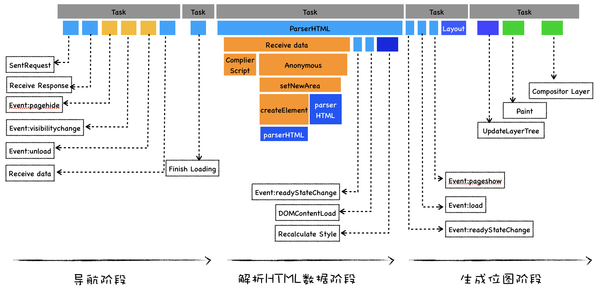

## 面板介绍

chrome devtools 的 performance 面板，查看的是网页运行时（而不是加载时）的性能。

分为三个区域：


可以看到黄色框出来的部分，其实对应页面的加载顺序：


参考：
- 官方资料：[分析运行时性能performance](https://developer.chrome.com/docs/devtools/performance?hl=zh-cn)
- https://juejin.cn/post/7204715616284082233
- https://time.geekbang.org/column/article/177070


## 分析步骤

通常，我们通过**概览面板**来定位到可能存在问题的时间节点，

1. 如果 FPS 图表上出现了红色块，那么就表示红色块附近渲染出一帧所需时间过久，帧的渲染时间过久，就有可能导致页面卡顿。
2. 如果 CPU 图形占用面积太大，表示 CPU 使用率就越高，那么就有可能因为某个 JavaScript 占用太多的主线程时间，从而影响其他任务的执行。
3. 如果 V8 的内存使用量一直在增加，就有可能是某种原因导致了内存泄漏。


接下来需要更进一步的数据，来分析导致该问题的原因，这就用到**性能面板**了。

*性能面板怎么看？*

> 那么要分析这些指标数据，我们就要明白这些指标数据的含义，不过要弄明白它们却并非易事，因为要很好地理解它们，需要掌握渲染流水线、浏览器进程架构、导航流程等知识点。简单来说，一条完整的渲染流水线包括了解析 HTML 文件生成 DOM、解析 CSS 生成 CSSOM、执行 JavaScript、样式计算、构造布局树、准备绘制列表、光栅化、合成、显示等一系列操作。

主要看main指标，它记录了渲染进程的主线程的任务执行记录：


每个灰色横条就对应了一个任务，灰线下面的横条就是一个个过程，可以把任务看成是一个 Task 函数，在执行 Task 函数的过程中，它会调用一系列的子函数，这些子函数就是我们所提到的过程。

分析页面加载过程：

加载过程主要分为三个阶段，它们分别是：
1. 导航阶段，该阶段主要是从网络进程接收 HTML 响应头和 HTML 响应体。
2. 解析 HTML 数据阶段，该阶段主要是将接收到的 HTML 数据转换为 DOM 和 CSSOM。
3. 生成可显示的位图阶段，该阶段主要是利用 DOM 和 CSSOM，经过计算布局、生成层树 (LayerTree)、生成绘制列表 (Paint)、完成合成等操作，生成最终的图片。



具体看[这一章节](https://time.geekbang.org/column/article/179428)，我们分析性能的时候，也可以采用这种方式去分析是哪些部分导致task执行时间很长的。

## 分析结果

### 分析每秒帧数

衡量任何动画性能的主要指标是每秒帧数 (FPS)。查看 FPS 图表。每当您看到 FPS 上方出现红色条时，就意味着帧速率下降得太低，可能会损害用户体验。一般来说，绿条越高，FPS 越高。

在 FPS 图表下方，您可以看到 CPU 图表。 CPU 图表中的颜色与“性能”面板底部的“摘要”选项卡中的颜色相对应。事实上，CPU 图表充满了颜色，这意味着 CPU 在录制过程中已达到极限。每当您看到 CPU 长时间处于最大负载时，就表明您需要寻找减少工作量的方法。


## 找到瓶颈

1、先查看摘要选项卡。当未选择任何事件时，此选项卡将显示活动的详细信息。可以看到页面大部分时间都花在渲染上。因此目标是减少渲染工作所花费的时间。

2、展开主要（main）部分。DevTools 会显示主线程上随时间推移的活动火焰图。X 轴代表随时间推移的记录。每个条形图代表一个事件。较宽的条形图意味着该事件所需的时间更长。Y 轴代表调用堆栈。当您看到事件堆叠在一起时，意味着上层事件导致了下层事件发生。

> 颜色区分：https://juejin.cn/post/7155350299295612941
>
> `灰色`就代表宏任务 task；`蓝色`的是 html 的 parse；`橙色`的是浏览器内部的 JS；`紫色`是样式的 reflow、repaint；`绿色`的部分就是渲染。其余的颜色都是用户 JS 的执行了，那些可以不用区分。

> 一些浏览器内部的函数，比如 parseHtml、evaluateScript 等，这些可以忽略


> 注意这个三角形，每当您看到红色三角形时，都表示警告可能存在与此事件相关的问题。


3、单击该事件。摘要选项卡现在显示有关该事件的信息。请注意显示链接，单击该按钮会将您跳转到源代码中的相关行。


4、我们看到下面会导致`强制布局`的代码。我们在 requestAnimationFrame 方法的回调函数中，改变了样式，然后获取值。这会导致浏览器必须首先应用样式更改，然后运行布局，只有这样它才能返回正确的值。

> 参考文章：https://web.dev/avoid-large-complex-layouts-and-layout-thrashing/?utm_source=devtools#avoid-forced-synchronous-layouts


## 一个真实的优化案例

首先，我们准备这样一段代码：

```html
<!DOCTYPE html>
<html lang="en">
  <head>
    <meta charset="UTF-8" />
    <title>worker performance optimization</title>
  </head>
  <body>
    <script>
      function a() {
        b();
      }
      function b() {
        let total = 0;
        for (let i = 0; i < 10 * 10000 * 10000; i++) {
          total += i;
        }
        console.log("b:", total);
      }

      a();
    </script>
    <script>
      function c() {
        d();
      }
      function d() {
        let total = 0;
        for (let i = 0; i < 1 * 10000 * 10000; i++) {
          total += i;
        }
        console.log("c:", total);
      }
      c();
    </script>
  </body>
</html>
```

很明显，两个 script 标签是两个宏任务，第一个宏任务的调用栈是 a、b，第二个宏任务的调用栈是 c、d。

首先用无痕模式打开 chrome，无痕模式下没有插件，分析性能不会受插件影响。

打开 chrome devtools 的 Performance 面板，点击 reload 按钮，会重新加载页面并开始记录耗时：

主线程是不断执行 Event Loop 的，可以看到有两个 Task（宏任务），调用栈分别是 a、b 和 c、d，和我们分析的对上了。（当然，还有一些浏览器内部的函数，比如 parseHtml、evaluateScript 等，这些可以忽略）

**Performance 工具最重要的是分析主线程的 Event Loop，分析每个 Task 的耗时、调用栈等信息。**

每个函数的耗时也都显示在左侧，右侧有源码地址，点击就可以跳到 Sources 对应的代码。


点击查看代码后，很明显， b 和 d 两个函数的循环累加耗时太高了。

在 Performance 中也可以看到 Task 被标红了，下面的 summary 面板也显示了 long task 的警告。

### 性能优化

我们优化的目标是把两个 long task 中的耗时逻辑（循环累加）给去掉或者拆分成多个 task。浏览器的 web worker 好像就是做耗时计算的性能优化的。

下面是改造后的代码：

```js
// worker.js
onmessage = function (e, num) {
  if (e.data === "runB") {
    let total = 0;
    for (let i = 0; i < num; i++) {
      total += i;
    }
    postMessage({ from: "b", result: total });
  }

  if (e.data === "runD") {
    let total = 0;
    for (let i = 0; i < num; i++) {
      total += i;
    }
    postMessage({ from: "d", result: total });
  }
};
```

```html
<!DOCTYPE html>
<html lang="en">
  <head>
    <meta charset="UTF-8" />
    <title>worker performance optimization</title>
  </head>
  <body>
    <script>
      // 创建一个 worker 实例
      let worker = new Worker("./worker.js");

      worker.onmessage = function (e) {
        if (e.data.from === "b") {
          console.log("b:", e.data.result);
        }
        if (e.data.from === "d") {
          console.log("c:", e.data.result);
        }
      };

      function a() {
        worker.postMessage("runB", 10 * 10000 * 10000);
      }

      function c() {
        worker.postMessage("runD", 1 * 10000 * 10000);
      }

      a();
      c();
    </script>
  </body>
</html>
```


完美，一个 long task 都没了。

就这样，我们一起完成了一次网页的性能优化，通过 Peformance 分析出 long task，定位到耗时代码，然后通过 worker 拆分计算量进行优化，成功消除了主线程的 long task。

参考：https://www.bmabk.com/index.php/post/110488.html

## 总结

Performance 工具最重要的是分析主线程的 Event Loop，分析每个 Task 的耗时、调用栈等信息。

**性能优化的目标就是找到 Task 中的 long task，然后消除它。**

有同学可能会问：为什么要优化 long task 呢？

因为[网页的渲染是一个宏任务](https://juejin.cn/post/7037839989018722340)，和 JS 的宏任务在同一个 Event Loop 中，是相互阻塞的。如果 JS 有长时间执行的 Task，就会阻塞渲染，导致页面卡顿。所以，性能分析主要的目的是找到 long task，之后消除它。

其实会分析主线程的 Event Loop，会分析 Task 和 Task 的调用栈，找出 long task，并能定位到耗时的代码，Performance 工具就算是掌握了大部分了，常用的功能也就是这些。

### 步骤

1、先找到 FPS 上方出现红色条的部分，就是我们要优化的地方

2、红色条的地方，也会对应下方的 long task

2、点击这个 long task，通过 Summary 选项卡或者 long task 调用栈宽度，找到耗时长的部分（是 JS 还是 Render 等）

3、结合 Summary 中提供的链接，定位到具体的问题代码。

> PS：如果是压缩的代码，可能还需要结合 sourcemap 进行查看。

### 个人理解

> 只适合页面操作时候卡顿的检测，不适合像首屏加载，页面加载卡顿的检测。

我：chrome 有个 perfomance 的工具适合分析页面操作运行时候的性能问题，因为它需要录制一段时间，在这段时间进行页面操作，如果操作的过程中页面卡顿，这种就适合 perfomance 进行分析，但是对于首屏加载来说，不适合用 perfomance 来分析，不知道我的理解对不对？

GPT：你的理解是对的。Chrome 的 `Performance` 工具确实是为了分析页面在运行时的性能问题而设计的。它可以帮助开发者捕获页面在一段时间内的所有活动，包括渲染、脚本执行、网络请求等，从而找出可能导致页面卡顿或延迟的原因。

当你提到“首屏加载”，你可能是指页面从开始加载到首次内容绘制（First Contentful Paint，FCP）或者到首次有意义绘制（First Meaningful Paint，FMP）的时间。对于这种性能分析，`Performance` 工具也可以提供一些信息，但可能不如其他工具详细。例如，Chrome 的 `Lighthouse` 工具就是专门为了分析页面加载性能、可访问性、最佳实践等而设计的。

简而言之：

- 如果你想分析页面在运行时的性能问题（例如滚动、动画、交互等导致的卡顿），那么 `Performance` 工具是很合适的。
- 如果你想分析页面的加载性能，尤其是首屏加载时间，那么 `Lighthouse` 可能会更有帮助。

但是，这并不意味着你不能使用 `Performance` 工具来分析首屏加载。你可以在页面开始加载时立即开始录制，然后在首屏内容完全加载后停止录制，这样也可以得到首屏加载的性能数据。但 `Lighthouse` 为这种分析提供了更多的上下文和建议。

## 参考

- https://developer.chrome.com/docs/devtools/performance
- https://developer.chrome.com/docs/devtools/performance-insights/
- [Vue Devtools 界面说明](https://cloud.tencent.com/developer/article/1878703)
- https://juejin.cn/post/7149093181244571678

## 附加

可以通过 Performance 更好的理清楚 Event Loop、宏微任务以及它们执行顺序问题。


参考文章：https://juejin.cn/book/7070324244772716556/section/7195729315693068299
